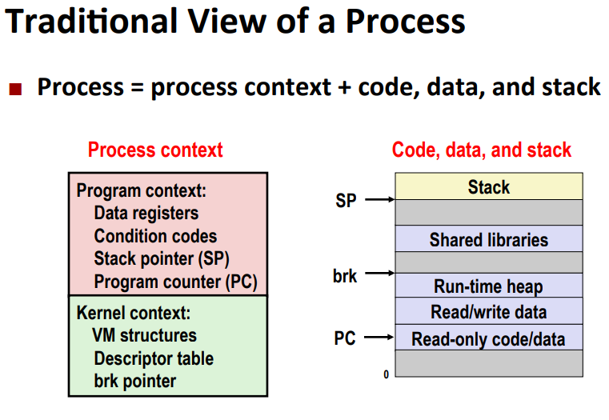
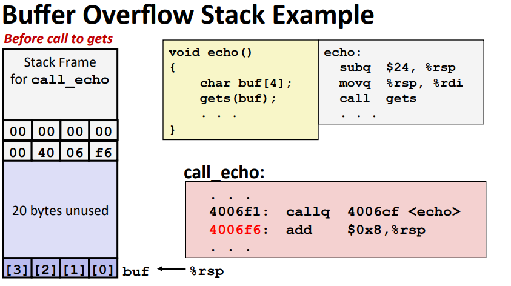
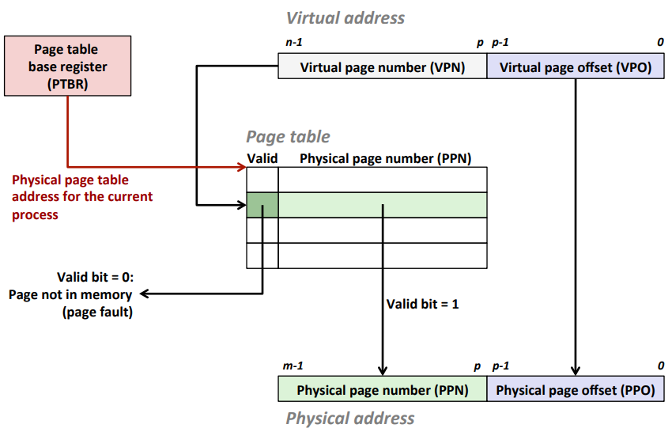
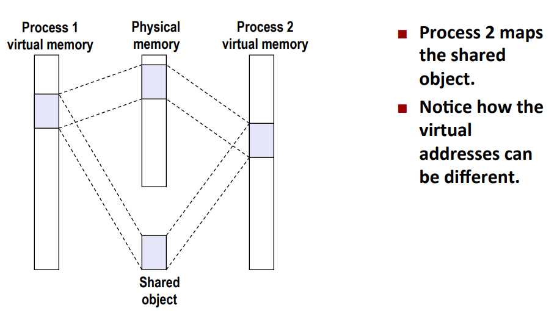

# 系统级I/O 

1. 读写文件

   

2. 共享文件

   - 描述符表：该进程打开的文件描述符来索引，每个打开的描述符表项指向**文件表**中的一个表项（每个进程一张表）

   - 文件表：打开文件的集合由该表表示，所有进程共享该表，表项有**当前文件的位置**、**引用计数**、**指向v-node表中对应表项的指针**

   - v-node表： 同文件表一样，所有进程共享该表，包含stat结构中的大多数信息，包括st_mode和st_size成员

     

3. I/O重定向

   

   

   调用dup2(4,1)后，两描述符都指向B,即描述符oldfd，从此以后标准输出重定向到了文件B,newfd -> oldfd

4. 待定1

5. 待定2

6. 待定3

# 网络编程

   1. 字节转换、IP地址和点分十进制转换

      ```c++
      #include<arpa/inet.h>
      uint32_t htonl(uint32_t hostlong);
      uint16_t htons(uint32_t hostshort);
      																								#返回：按照网络字节顺序的值
      uint32_t ntohl(uint32_t netlong)
      uint16_t ntohs(uint16_t netshort)		
          																							#返回：按照主机字节顺序的值
      int inet_pton(AF_INET,const char* src,void* dst);
      																	#返回：若成功则为1，若src为非法点分十进制则为0，若出错则为-1
      const char* inet_ntop(AF_INET,const void* src,char* dst,socklen_t size);
      																		#返回：若成功则指向点分十进制字符串的指针，若出错则为NULL
       
      ```

      "n"代表网络，"p"代表表示，"h"代表主机

   2. 套接字接口

      - 一个套接字就是通信的一个端点，套接字就是一个有相应描述符的打开文件，套接字地址存放在sockaddr_in的16个字节结构中，sin_family成员AF_INET，sin_port成员是一个16位的端口号，sin_addr成员就是一个32位的IP地址。IP地址和端口号总是以网络字节顺序（大端法）存放的

      ```C++
      /* IP socket address structure */
      struct sockaddr_in{
          uint16_t	sin_family;		/* Protocol family (always AF_INET) */
          uint16_t 	sin_port;		/* Port number in network byte order */
          struct in_addr sin_addr;	 /* IP address in network byte order */
          unsigned char sin_zero[8];	 /* Pad to sizeof(struct sockaddr)
      }
      
      /* generic socket address structure (for connect ,bind, and accept) */
      struct sockaddr {
          uint16_t sa_family;		/* Protocal family */
          char sa_data[14]; /*Address data */
      }
      ```

      - socket函数

        ```c++
        #include<sys/types.h>
        #include<sys/socket.h>
        int socket(int domain,int type,int protocol);
        #返回：若成功，则返回非负描述符，出错为-1
        ```

      - connect函数

        客户端通过调用connect函数建立和服务器的连接，connect试图和套接字地址为addr的服务器建立一个因特网

        ```c++
        #include<sys/socket.h>
        int connect(int clientfd,const struct sockaddr* addr,socklen_t addrlen);
        //返回:若成功则为0，出错则返回-1.
        ```

      - bind函数、listen函数和accept函数，服务器用它们来和客户端建立连接

        ```c++
        #include<sys/socket.h>
        int bind(int sockfd,const struct sockaddr* addr,socketlen_t addrlen);
        //返回：成功则为0，出错则为-1
        int listen(int sockfd,int backlog);
        //返回：若成功则为0，出错则为-1
        int accept(int listenfd,struct sockaddr* addr,int* addelen);
        //返回：若成功则为非负连接描述符，若出错则为-1
        ```

   3. 主机和服务转换

      - getaddrinfo()函数

        getaddrinfo函数将主机名、主机地址、服务明和端口号的字符串转化成套接字地址结构

        

      - getnamenameinfo()函数

        getnameinfo函数与getaddrinfo函数是相反的，将一个套接字地址结构转换成相应的主机和服务名字符串

        

   4. sockets

      socket是逻辑层面上的一个端点，即连接中的一个端点，从应用程序角度，它是一个文件描述符

      Socket 地址结构

      

      

      `sockaddr_in` 结构体是 `sockaddr` 的子类

      CS 架构流程图：

      

      - `getaddreinfo()` 函数

      ```c
      #include <sys/types.h>
      #include <sys/socket.h>
      #include <netdb.h>
      
      int getaddrinfo(const char *node, const char *service, const struct addrinfo *hints,
                  struct addrinfo **res);
      
      void freeaddrinfo(struct addrinfo *res);
      
      const char *gai_strerror(int errcode);
      ```

      其中 result 返回的是一个链表，比如一个域名可能对应多个 IP 地址。并且会自己 free

      

      - `socket()` 函数：客户端和服务器端用来创建一个 socket 文件修饰符

        ```
        int socket(int domain, int type, int protocol);
        
        // 通常使用
        int fd = socket(AF_INET, SOCKE_STREAM, 0);
        ```

        

      - `bind()` 函数：专门用于服务器端将 fd 和 网络地址绑定在一起

        ```
        int bind(int sockfd, const struct sockaddr *addr, socklen_t addrlen);
        ```

      - `listen` 函数：用于告诉内核这是一个服务器而不是客户端

        ```
        int listen(int sockfd, int backlog);
        ```

      - `accept` 函数：用来接收客户端的连接

        ```
        int accept(int sockfd, struct sockaddr *addr, socklen_t *addrlen);
        ```

        其会返回一个新的 fd 用于同客户端进行交流。

      - `connect` 函数：用于客户端连接服务端

        ```
        int connect(int sockfd, const struct sockaddr *addr, socklen_t addrlen);
        ```

      当客户端发送一个 EOF 信息给服务器端的时候，服务器端才会结束对于客户端连接的处理。因此可以看到服务器端的网络 IO 模型只是单纯的串行模式，无法在较短时间内处理多连接。各种优化可以参见**网络 IO 复用模型**。

   5. 待定

# 并发编程

并发编程的几种形式

- 基于进程(Process-based)：内核自动交错(interleaves)执行多个逻辑流，每个逻辑流有自己的私有地址空间
- 基于事件(Event-based)：程序员手动交错执行多个逻辑流，所有的流共享相同的地址空间，使用 IO 多路复用来进行交错调度
- 基于线程(Thread-based)：内核自动交错(interleaves)执行多个逻辑流，每个逻辑流共享相同的地址空间，基于事件和进程的混合

1. 基于进程的并发

   

   当客户端连接进入的时候，fork 子进程来处理客户端连接，继续进入 accept 流程，可以在处理该客户端连接的同时继续接收其他客户端的连接。每个客户端的请求都由独立的子进程来进行处理。

   但是需要注意：

   1. 主进程必须要监听子进程的状态，收割子进程来防止内存泄漏。
   2. 由于子进程是 fork 父进程，因此连接描述符也会被复制一遍，因此在子进程中要关闭连接描述符，因为连接描述符只有在引用计数为 0 的情况下才会被关闭。

   特点：

   1. 简单明了而且可以并发解决多连接请求问题
   2. 进程控制需要额外开销，并且在进程之间共享数据比较难，只有文件表会共享，其他都不会共享

2. 基于事件的并发

   服务器端维护一系列活跃的连接，比如连接描述符数组，然后服务器确定哪些描述符有待处理的输入。使用 `select` 或者 `epoll` 系统调用来确定。由于当有连接进入或者输入信息的时候，描述符的状态会发生变化，`select` 或者 `epoll` 函数会根据这些状态的变化来处理连接描述符，而这些状态的变化就可以看作事件的变化

   

   很多 web 服务器比如 nodejs、nginx 都是采用这种方式进行处理的。

   特点：

   1. 从始至终只有一个逻辑流和地址空间，方便调试，没有额外的进程和线程开销。
   2. 比基于进程和线程的方式设计更加复杂。
   3. 无法利用多核的优势。

3. 基于线程的并发

   

   

4. 同步基础

   如何确切知道一个变量到底有没有被共享：

   1. 现存的内存模型是什么？
   2. 变量实例是如何映射到内存中去的？
   3. 这些实例中有多少线程对其进行引用？

   🔵线程内存模型

   理论模型：

   - 多线程在进程的上下文中进行运行（代码、数据、堆栈、共享库的虚拟地址空间等）
   - 每个线程都有独自且分离的线程上下文（线程 ID，栈，PC等）

   实际上：

   - 每个线程寄存器的值确实被分离和保护，但是任何线程都可以访问读写其他线程的堆栈数据

   🔵内存映射

   全局变量：存放在虚拟内存中(堆)且只有一个实例。

   局部变量：存放在线程栈中并且只有一个实例

   局部静态变量：存放在虚拟内存中，且只有一个实例。（相当于仅限当前的函数使用的全局变量）

   🔵信号量机制 semaphore

   semaphore 即非负的全局数字同步变量，通过 P，V 操作来进行管理。

   P：如果信号量非 0 则减一，如果为 0 则阻塞直到非 0.

   V：给信号量 + 1

   C 中的信号量：

   ```
   #include <semaphore.h>
   int sem_init(sem_t *s, 0, unsigned int val); /* s = val */
   int sem_wait(sem_t *s); /* P(s) */
   int sem_post(sem_t *s); /* V(s) */
   ```

   信号量机制可以用来处理同步和互斥的情况。

5. 同步进阶

   - 消费者-生产者问题（同步模型）

     

   - 读者-写者问题（互斥模型）：

     - 可以多个读者一起读
     - 读写不能同时进行

     不过解决方案有两种方式：

     - 偏向读者的读者-写者模型：读者的优先级较高，写者可能会出现饥饿现象

       

       - 偏向写者的读者-写者模型：写者的优先级较高，读者可能会出现饥饿现象

     🔵线程池实现

     🔵线程安全

     可能会出现线程不安全的情况：

     1. 不能保护共享变量

     2. 在不同函数调用之间以来其他函数中的持久状态变量

        

        比如 C 中的 rand 库，其中 next 的值有可能会被其他线程修改。

     3. 函数总返回指向同一个全局变量的指针

6. 待定

# 信息的表示和处理

1. 信息存储

   - 每台计算机都有一个字长，指明指针的标称大小，虚拟地址是以这样的一个字来编码，字长决定的最重要的系统参数是虚拟地址空寂的最大大小，对于字长为w位的机器，虚地址空间范围为0~$2^w-1$,程序最多访问$2^w$个字节

2. 大端机和小端机

   - 在内存中按照从低有效字节到最高有效字节的顺序存储对象称为小端法(little endian);在内存中从最高有效字节到最低有效字节的顺序存储称为大端法(big endian)。0x01234567在两种不同机器的存储方式

     

     ```c++
     typedef unsigned char *byte_pointer;
     void show_bytes(byte_pointer start, size_t len) {
         size_t i;
         for (i = 0; i < len; i++)
     	printf("%p\t0x%.2x\n", &start[i], start[i]); 
         printf("\n");
     }
     void show_int(int x) {
         show_bytes((byte_pointer) &x, sizeof(int)); 
     }
     void show_float(float x) {
         show_bytes((byte_pointer) &x, sizeof(float));
     }
     void show_pointer(void *x) {
         show_bytes((byte_pointer) &x, sizeof(void *));
     }
     /* $end show-bytes */
     
     ```

3. 浮点数表示

   标准：$V = (-1)^s*M*2^E$

   - 符号(sign)，s=0是正数，s=1是负数，数值0的符号位解释作为特殊处理
   - 尾数(significand)，M是一个二进制小数，范围是1~2-ε，或者0 ~ 1-ε
   - 阶码(exponent)，E的作用是对浮点数加权，权重是2的E次幂(可能是负数)，将浮点数的位表示划分三个字段，分别对这些值编码
   - k位阶码字段exp=e~k-1~...e~1~e~0~编码阶码E
   - n位小数字段frac=f~n-1~...f~1~f~0~编码尾数M，但是编码出来的值也依赖阶码字段的值是否等于0

   两种常见格式: 单精度：1、8、23；双精度：1、11、52

   

    根据exp的值，被编码的值分成三种不同的情况

   

   - 规格化值

     当exp的位模式不全为0也不全为1，E = e - Bias，其中e为无符号数，Bias等于$2^k-1^-1$(单精度127，双精度1023)，即单精度阶码E的取值范围为-126~127，双精度阶码E的取值范围为-1022-1023

     小数字段frac被描述为小数值f,其中0≤f<1，其二进制表示0.f~n-1~...f~1~f~0~，尾数定义M = 1+f。这种方式叫做隐含开头1的表示，通过调整阶码E,使M 的范围在1≤M<2

   - 非规格化值

     阶码全为0时，阶码值E=1-Bias，尾数的值为M=f，不包含隐含的开头1

   - 特殊值

     阶码全为1的时候，小数域全为0，得到的值表示无穷，当s=0时，表示+∞，s = 1时，表示-∞。当小数域为非零时，表示NAN

4. 待定

5. 待定

6. 待定

# 程序机器级表示

1. x86整数寄存器

   

   对于一般函数来说，第一个参数存放在 %rdi，第二个参数存放到 %rsi 中，第三个参数存在%rdx，从函数中返回结果存放到 %rax 中

   - movq A,B指令

     

     (%rax)表示rax寄存器中存储的为一个内存地址，使用()表示去除这个内存中的数据

     D(%rax)` 表示在这个内存地址上进行偏移，然后取出内容，相当于 `(%rax + D)

     D(%rax, %rbx, S)` 相当于 `(%rax + s * %rbx + d)`，其中 %rbx 不可以被替换为 rsp, S 只能取 1,2,4,8

     

     

   - leaq指令 ： 从内存数据读到寄存器

     leaq src,dst

     src通常是个表达式，用于将表达式计算结果存放到dst中

     ```c++
     leaq (%rdi, %rdi, 2), %rax	# t = x + x * 2
     salq $2, %rax	# t << 2
     ```

     区别 ：假设eax存放的是地址，leaq (eax+2*eax),eax 表示将内存地址为eax的值的3倍放到eax中，相当于创建指针并解引用；movq (eax+2*eax),eax 表示取内存地址eax+2*eax里面的值放到eax里面，至于值是什么，不知道M[.....]

   - 位标记(控制流中)

     1. CF，Carry Flag 表示进位标记，用于 unsigned 类型
     2. SF，Sign Flag，用于 signed 类型，表示 if res < 0
     3. ZF，Zero Flag，计算结果为 if res == 0
     4. OF，Overflow Flag，用于 signed 类型，判断补码是否溢出 (a > 0 && b > 0 & res < 0) || (a < 0 && b < 0 && t >= 0)

   - compq b,a

     计算a-b的并且不改变结果，只产生位标记

   - testq a,b

     用于计算a&b，通常与自身比较，testq a,a

     ZF = 1 if a & b == 0

     SF = 1 if a & b < 0

   - set指令

     

     setne %rax 将ZF标志位取反存放到rax寄存器中

   - movzbl %al, %eax

     movzbl 全称 move with zero extension byte to long，将 al 中的值移到 eax 中，并且将剩余位置零。

     setg %al   当>时，将al设置为1

     

   - J*指令 跳转指令

     

     

2. **procedures过程调用**

   - 控制执行流程(stack)

     1. 过程调用(call)：rip存放当前执行指令的地址，遇到call指令，会发生三件事，rip的值更新为call label中的指令地址，栈指针减少8(64位机)，并且将调用之后的栈指针地址写入栈顶部

     2. 返回地址：   rip执行call指令，直至遇到ret

     3. 过程返回(ret)：ret逆转call效果，假定栈顶部有一个想要跳转的地址，rip值更新为栈顶(call中栈指针减少后的那个)，此时从栈中pop出该地址，栈指针增加，然后继续按照原来的方式继续运行

        `ret指令将始终采取栈指针指向的地址并将它作为返回地址`

   - 传递数据

     对于函数传递参数来说，前 6 个参数分别传递给 rdi, rsi, rdx, rcx, r8, r9 寄存器，之后的参数传递到栈中；返回值传递到 rax 中。对于浮点数会有专门的寄存器

   - 管理局部参数

     通常这些参数和环境变量会存储在栈的每一个对应的栈帧中。 

   - 寄存器保存规则

     1. `Caller Saved`：调用者在调用 `call` 命令之前将临时值保存到其栈帧中。%r10，%r11

     2. `Callee Saved`：被调用者在被调用之前将临时值保存到栈帧中，结束调用时候恢复调用者栈帧中的临时变量。%rbx，%rbp,%r12~%r14

        

        当进行函数调用时，会将调用者的信息（临时变量，可选参数，调用者和被调用者寄存器信息，返回地址）等入栈，等待被调用者函数执行完毕再恢复原状。

3. 数据表示

   - 多维数组

     

   - 指针数组

     1. 数组：数组是用来存储多个相同类型数据的集合
     2. 指针：指针相当于一个变量，存放的是其他变量在内存中的地址

     `#define UCOUNT 3`

     `int *univ[UCOUNT] = {mit,cmu,ucb}`

     

     `[]`优先级要比`*`的优先级要高，univ指向数组，大小为8字节

     

     `嵌套数组只需要访问内存1次，指针数组需要访问2次`

   - struct表示

     `struct rec{

     ​	int a[4];

     ​	size_t i;

     struct rec* next;

     };`

     

     

     特点：

     1. 足够大来保存各个属性
     2. 根据声明顺序在内存中的排列顺序
     3. 根据地址和偏移量来定位到对应的属性

     内存对齐三种方式：数据对齐，数据结构填充以及紧缩

     

     为什么需要数据对齐：

     1. 现代计算机在数据自然对齐的时候读写内存效率最高。

     如何对齐：

     1. 主要数据类型为 K 字节，那么数据存储起始地址必须是 K 的整数倍。

     其中主要数据类型的定义为该结构体中最大字节的类型。

     如果对于一个结构体，其最终大小不是 K 的整数倍，编译器会在结构体末尾填充字节数来使其成为 K 的整数倍。

     

     需要注意一点的是，最终填充的字节数**也算在**结构体之内

     ```c++
     #include <stdio.h>
     
     typedef struct {
         char c1;        // 2 + (2) padding
         int i1;         // 4
         char c2;        // 2 + (2) 末尾填充
     } a;
     
     
     typedef struct {
         int i1;         // 4
         char c1;        // 2
         char c2;        // 2
     } b;
     
     
     typedef struct {
         double f1;      // 8
         int a1;         // 4
         int a2;         // 4
         char cc1;       // 1 + (7)
     } c;
     
     int main() {
         a a1;
         b b1;
         c c1;
         printf("%ld, %ld, %ld\n", sizeof(a1), sizeof(b1), sizeof(c1));
         // 12, 8, 24
     }
     ```

   - 待定

4. advanced

   - x86-64 linux内存布局

     

     硬件限制只能使用47位地址，0x00007FFFFFFFFFFF

     text存放可执行程序

     Data/share libraries存放程序开始时分配的数据(全局变量、静态数据)

     Heap存放程序运行动态变化的变量，malloc(),calloc(),new()

   - 缓冲区溢出

     ```c++
     typedef struct {
         int a[2];
         double d;
     } struct_t;
     double fun(int i){
         volatile struct_t s;
         s.d = 3.14;
         s.a[i]=1073741824;
         return s.d;
     }
     ```

     c/c++中没有对数组索引进行边界检查，因此会出现缓冲区溢出的情况，引发系统安全漏洞。

     大部分缓冲区溢出是试图存储从信息中读取的字符串，但是不知道字符串有多大。很多苦厄函数不会检查边界，C中的`gets()`函数

     ```c
     char* gets(char* dest){
         int c =getchar();
          char *p = dest;
         while(c != EOF && c != '\n') {
             *p++ = c;
             c = getchar();
         }
         *p = '\0';
         return dest;
     }
     ```

     缓冲区溢出的关键就是编写的代码无法保证数据的边界是 100% 有限的，从而导致会恶意程序会无限读取信息

     ```c
     void echo() {
         char buf[4];
         gets(buf);
         puts(buf);
     }
     ```

     对应的汇编

     ```c
     4005d6:       48 83 ec 18				sub    $0x18,%rsp
     // ===== Canary start part1 ====
     4005da:       64 48 8b 04 25 28 00		mov    %fs:0x28,%rax
     4005e1:       00 00
     4005e3:       48 89 44 24 08			mov    %rax,0x8(%rsp)
     // ===== Canary Over ====
     4005e8:       31 c0						xor    %eax,%eax
     4005ea:       48 89 e7					mov    %rsp,%rdi
     4005ed:       e8 ce fe ff ff			callq  4004c0 <gets@plt>
     4005f2:       48 89 e7					mov    %rsp,%rdi
     4005f5:       e8 96 fe ff ff			callq  400490 <puts@plt>
     // ===== Canary start part2====
     4005fa:       48 8b 44 24 08			mov    0x8(%rsp),%rax
     4005ff:       64 48 33 04 25 28 00		xor    %fs:0x28,%rax
     // ===== Canary Over ====
     400606:       00 00
     400608:       74 05						je     40060f <echo+0x39>
     // ===== Canary Function
     40060a:       e8 91 fe ff ff			callq  4004a0 <__stack_chk_fail@plt>
     40060f:       48 83 c4 18				add    $0x18,%rsp
     400613:       c3						retq
     ```

     结果：

     ```c
     $ ./b
     12345678
     12345678
     $ ./b
     123456789
     123456789
     *** stack smashing detected ***: ./b terminated
     Aborted
     ```

     由汇编代码可以知道，虽然代码中只给分配了 4 字节的空间，但是在汇编代码中分配了 0x18 字节的空间，因此稍微超出一点范围程序也可以正常运行。在没有系统保护的情况下可以写满 0x18 个字节，这里是因为stack canary 保护的原因只写了 10 字节导致提前异常。

     

   - 代码注入攻击

     

     在没有 baby canary 的情况下，分配的 `char` 数组保存在栈帧中，并且 `gets` 会分配 20 个额外的字节；再紧接着就是上一个函数的返回地址。代码注入的思想就是修改上个函数的返回地址，跳到恶意代码的地址。

     

   如果输入数据没有超过缓存区，没有影响，超过缓存区后，输入数据会影响到会影响到正常返回的内存地址，

   防护：

   - 怎么防护？

   - 使用安全函数比如 fgets() 替代 gets() 函数。

   - 系统级别的保护：当程序运行时随机分配栈/堆的地址

   - 从硬件层面标记栈上的数据不可被执行

   - stack canary，在 canary 部分写入特定字符，等执行完毕后检查 canary 字段字符是否一致，如果不一致就表示缓冲区溢出，从而提前报错。

     

   - ROP 攻击 Return-Oriented Programming

     栈随机化、不可执行栈和 canaries 保护措施会导致缓冲区溢出攻击失败，栈随机化会很难预测缓冲区的位置，不可用执行栈很难取插入二进制代码。

     栈随机化和不可执行栈可以被ROP破解

     

     可选策略：

     - 使用现存代码，比如库代码(stdlib)
     - 虽然使用栈堆随机化，但是全局变量和代码的地址并未改变。可以将一系列代码拼接成字符串，组合在一起

     方法：

     - 找到一些 gadgets (可以理解为小片段的代码)，其中最后一个字节为 0xc3 (ret)

       

       对于这段代码可以使用后两句代码来获取寄存器 rdi 和 rdx 中和的值

       也可以使用部分代码

       

   - UNION

     联合体的域都存储在一个地方，分配的内存取决于占用空间最大的那个域，不是为所有的域同时分配空间

     

5. 待定

# 程序优化

1. 常见技巧

   - code Motion代码移动

     ```c
     void func(int m, int n) {
         for(int j = 0; j < n; j++) {
             a[m * n + j] = b[j];
         }
     }
     
     void func(int m, int n) {
         // 防止重复计算浪费资源
         int k = m * n;
         for(int j = 0; j < n; j++) {
             a[l + j] = b[j];
         }
     }
     ```

   - share common subexpressions共享常用子表达式

     ```c
     up		=	arr[(x-1)*m + j];
     down	=	arr[(x+1)*m + j];
     
     // 优化
     
     int k = x * m + j;
     up 	= arr[k - m];
     down = arr[k + m]
     ```

   - Procedure Call Optimization (strlen problem) 函数调用优化

     ```c
     void lower(char *s) {
         size_t i;
         for (i = 0; i < strlen(s); i++)
             if (s[i] >= 'A' && s[i] <= 'Z')
                 s[i] -= ('A' - 'a');
     }
     
     // 优化 for 循环调用多次 strlen
     
     void lower(char *s) {
         size_t i;
         size_t len = strlen(s);
         for (i = 0; i < len; i++)
             if (s[i] >= 'A' && s[i] <= 'Z')
                 s[i] -= ('A' - 'a');
     }
     ```

     这里出现的问题就是每次循环都需要调用 `strlen` 函数，在函数返回值始终不变的情况下，重复调用时十分耗费资源，编译器不优化的原因是因为1.代码循环中字符串被修改，2.编译器如何确定strlen的版本被实际使用，库函数是在链接阶段中调用，不在编译器

   - Memory aliasing

     aliasing 就是当程序的不同部分引用内存中相同位置时候，可以使用一个内存数据结构覆盖另一个数据结构,即对一片内存区域既查询又修改

     ```c
     void sum_rows1(double *a, double *b, long n) {
         long i,j;
         for(int i = 0; i < n; i ++) {
            	double val=0;
             for(int j = 0; i < n; j ++) {
                val +=a[i*n+j];
             b[i] = val;
             }
         }
     }
     //通过引入局部变量重写代码，求和结果保存在该局部变量中，不会重复修改b中的值
     ```

     

     对内存的读写限制了程序的性能，会重复读b中的值并写入无关的值

     编译器不优化的原因是无法预先确定是否存在的内存别名使用

2. 待定

3. 待定

# 内存结构

1. 总线结构

   

   

   I/O桥是区分cpu芯片区的一个芯片集合

   

   sector存储数据(512字节)，gap不存储

   

   磁盘读取，当要读取的数据和磁臂在同一磁道上，等待即可，否则，磁臂移动到该数据在的磁道上等待即可

   - locality: programs tend to use data and instructions with addresses near or equal to those they have used recently

     时间局部性：最近引用项很可能在不仅的将来继续引用

     空间局部性：最近被访问过单元地址附近很有可能也会被访问

     往往越好使用局部性原理对应的程序性能也会越好。比如在遍历二维数组的时候，先从行遍历还是先从列开始遍历，如果先从列开始进行遍历，对于空间局部性来说就很不友好，因此两者遍历方式最终导致的性能差异也会很大

   - 内存等级

     缓存概念的出现就是基于局部性原理。如果寄存器想要获取内存中的数据信息，首先寄存器从缓存中找对应的数据，如果找到(hit)则可以直接返回给寄存器，如果未命中(Miss)则需要将主存中的数据传输到缓存中，再传给寄存器

     - Cold(Compulsory) miss: 冷 miss 的原因是因为缓存为空，无法命中是必然的
     - Conflict miss：冲突未命中，这和缓存的实现方式有关（下一节）
     - Capacity miss: 这归结于缓存的大小是固定的，而需要访问的数据范围大于缓存大小

     

     *操作系统会保留一部分内存来存储已加载的文件，读取磁盘文件时，实际上将从主存中的文件缓存中被读取，而不是去磁盘上读取*

2. 高速缓存器

   

   通用缓存组织结构，通常用S,E,B来表示：其中S表示有$2^s$个set，E表示每个set中含有$2^e$个line，B表示block,每个line有$2^b$个字节在每个block中：

   - v(valid) 表示这个块是否有实际意义
   - tag 用于帮助搜索 block
   - 数据部分

   缓存读

   CPU发送地址到缓存，要求缓存返回地址，这个地址由多个部分组成：

   

   - t 表示 tag 用于帮助搜索
   - s 表示 set 的索引位置
   - b 确定 block 中该目标数据开始的偏移量

   首先通过 set index 来确定数据对应缓存中的 set，然后会检查t位 tag 确定 line 中的 tag 是否与之匹配，并且检查 line 中的有效位是否开启。如果以上条件都满足，则表示缓存命中。

   - 直接映射：

     

     直接映射很有可能会导致某处 Cache 淘汰换出频繁，而某处 Cache 空着也不会使用。Cache 的存储空间得不到充分利用。

     特定就是简单，成本低，地址变换快速且不涉及替换算法的问题。

     由于缓存之间的低关联性，因此需要增加 line 的数量。

   - 多路组相联映射

     

     二路组相联，找到对应set之后，对比每个line的tag，如果相符，则缓存命中

   - 全相联映射

     全相联映射相当于极端情况下的组相联映射，cache 中只有一个 set，set 中包含缓存中所有的 block。但是存在一个问题就是如果缓存过大的话，寻找 tag 会存在 O(n) 时间复杂度的问题，而且硬件设计也比较复杂。因此全相联高速缓存只适合做小的高速缓存，比如虚拟内存中的块表(TLB)，用于缓存页表项。

   - 缓存写

     Write-hit 有两种策略：

     1. write-through：直写策略，直接将数据写回内存，但是访问消耗十分昂贵。
     2. write-back：回写策略，不会直接写回内存，直到对应缓存区域被替换就写回。需要添加额外的位标记是否被修改过。

     Write-miss 也有两种策略：（即想要写入的数据不在缓存中）

     1. write-allocate: 即将内存中的数据写入缓存，在缓存中进行更新，如果之后有更多的写操作，会明显有性能提示。
     2. no-write-allocate: 直接写入内存

     

   - 缓存抖动

     ```c
     float dotprod(float x[8], float y[8]) {
         float sum = 0;
         for(int i = 0; i < 8; i++)
             sum += x[i] * y[i];
         return sum;
     }
     ```

     解决方法：

     1. 将数组长度拉长
     2. 使用临时变量存储数组中的数据 (lab 操作)

     在空间局部性较好的情况下，仍然可能会导致缓存不命中

   - 缓存性能评估指标

     - Miss rate
     - Hit time
     - Miss Penalty，即缓存命中失败所需要额外耗费的时间

     缓存命中要比缓存未命中的速度要块 100 倍。

     99% 的命中率要比 97% 性能高两倍 

   - 高速缓存对程序的影响

     

     的

   - 空间局部性优化典型案例

     根据内存山（csapp封面）的内容，最典型的优化方案就是矩阵乘法：

     如果采用 ijk 的方式进行相乘：

     

     对于矩阵 B 来说就很不符合空间局部性的要求，缓存命中率几乎为 0.

     而对于 kij 的方式来说：

     

     空间局部优化

     

   - 时间局部优化

     

     上图是一种 bijk 的矩阵乘法形式。基本思想就是将矩阵 A 和 C 拆分成 1×bsize 行条状数组，将 B 拆分为 bsize×bsize 的块状数组。然后进行以下运算：

     ```c
     void bijk(array A, array B, array C, int n, int bsize) {
         // n 是矩阵的边长
         // en 表示原矩阵可以正好 bsize*bsize 方块的长度
         int en = bsize * (n / bsize);
         for (int kk = 0; kk < en; kk += bsize) {
             for (int jj = 0; jj < en; jj += bsize) {
                 for(int i = 0; i < n; i++) {
                     for(j = jj; j < jj + bsize; j++) {
                         double sum = c[i][j];
                         for(k = kk; k < kk + bsize; k++) {
                             sum += A[i][k] * B[k][j];
                         }
                         c[i][j] = sum;
                     }
                 }
             }
         }
     }
     ```

     jk 循环多次重复使用 A 矩阵的行条状数组，相比于 kji 的乘法方式进一步提高的时间局部性。

     对于 i 循环，又多次重复使用 B 矩阵中的块状数组，也提高了对 B 矩阵的时间局部性。

     当数组过于小的时候可以不使用分块技术。

     分块技术受矩阵大小和缓存的配置信息（block 数据大小，line 的数量以及cache大小）都有关系，不好掌控最好的优化方法

3. daudf

4. dadhf

# 链接

链接操作可以在编译时(compile time)、加载时(load time)和运行时(run time)执行。

1. 为什么需要链接器：

   - 模块化，程序可以写成一个个小的模块化文件，提高代码的可复用性
   - 效率，只需要将修改的模块重新编译，再将所有的模块重新链接，不需要重新编译其他源文件

2. 连接器做了什么：

   - 符号解析，symbol resolution

     符号指的是：程序定义和引用的符号（全局变量和函数），符号表中的符号

     

   - 重定向relocation

     将所有模块合并到一个可执行目标文件中。在合并的时候必须搞清楚每个符号被存储到哪里，并且会决定程序执行的时候每个符号最终在内存中的位置，将绝对内存位置和符号绑定在一起

     

     三种模块

     - relocateable object file(`.o`文件)

       有`.c`文件用编译器生成，用于生成可执行文件

     - executable object file(`.out`文件)

       可以直接运行的程序

     - share object file(`.so`文件)

       可以动态链接的特定重定向文件

3. ELF文件格式

   ELF 全称 Executable and Linkable Format，可执行和可链接格式，是 `.o` 、`.so` 和可执行文件的统一格式。

   

   - ELF 头：定义了字(word)的大小、字节顺序以及文件类型的内容，机器类型，节头部表(section header table)
   - segment header table: 为可执行文件而定义，用来指明代码所有不用的段所在内存位置
   - text 表：用于存储代码信息（只读）
   - rodata 部分：用于存储 switch 语句中的跳转表（只读）
   - data 部分：用于保存所有已初始化的全局变量和静态 C 变量。
   - bss (**b**lock **s**tarted by **s**ymbol)部分：定义了未初始化的全局变量和静态 C 变量。以及所有被初始化为 0 的全局变量和静态变量。
   - symtab 部分：是一个 struct 数组，存储函数和静态变量的名称，以及各个段的名称和位置，存放程序中定义和引用的函数和全局变量信息，与编译器中的符号表不同，不包含局部变量的条目
   - rel txt/data 部分，编译器告诉链接器需要进行链接的函数和变量
   - debug 部分，包含将原代码行号和机器代码中行号向关联的信息，需要使用 `-g` 参数才有。
   - section header table: 告诉不同 section 的其实位置

   静态变量存储在 bss 段或者是 data 段

   链接符号：

   - 全局符号(global symbols) : 在本模块中定义，被其他模块使用
   - 外部符号(external symbols): 在本模块中使用，在其他模块定义
   - 局部符号(local symbols): 符号只在本模块中定义和使用

4. 链接规则

   同名符号分为强和弱：

   - 强符号：函数或者已初始化的全局变量
   - 弱符号：未初始化的全局变量

   链接器如何区分重复的符号

   - 不允许多个同名强符号
   - 如果有一个强符号，只选择强符号；引用弱符号会解析为强符号

   

   以上是可能会出现的链接错误。第三种情况如果写入 x 的值，会导致覆盖 y 的值，因为 double x 为 8 个字节，p1 中 x 和 y 数据保存相连的，所有会导致 x 覆盖 y 的值

   链接器如何重定向：

   

   当编译器对于单个源文件进行编译的时候，如果引用外部符号时候会为留下占位符，然后等链接器将对应符号进行链接即可。图中留给 array 地址暂时填充为立即数 0。a 和 f 为对应 text 段的偏移量

5. 静态链接库

   对于经常使用的函数，将其定义在一个库中，提高代码复用性

   静态链接库将所有的重定向文件链接成一个单独的文件。

   

   如果一个程序调用了库中的函数，链接器如果检测到有使用到对静态链接库 (`.a`) 中函数的引用，它会将相应的模块 (`.o`) 拉出来并且忽略其他的模块。

   链接器在链接静态库的步骤：

   1. 按指令顺序扫描所有 `.o` 和 `.a` 文件
   2. 在扫描期间，保存一个当前还未解析引用的清单
   3. 遇到每个新的 `.o` 和 `.a` 文件就扫描定义在目标文件中未解析的符号
   4. 如果扫描结束后还存在为解析的符号则报错。

   *在C/C++编译链接过程中，对文件不同顺序可能会导致不同的结果*

6. 动态链接库

   静态库有个缺点：每个内部使用 printf 的函数都必须要有 printf 函数的副本

   动态链接库：动态将数据和代码加载到应用中，可以在程序加载期间或者运行期间。可以减小程序体积。

   

   在运行期间加载动态链接库：

   

   

7. 待定

# 异常控制流

之前学过两种改变控制流的方法：jump 和 call。但是之前只能改变**程序状态**，但是很难对**系统状态**改变做出反应：比如除 0，ctrl+c，硬盘状态等，因此就需要异常控制流来进行处理

异常控制流存在于计算机系统多个层级：

- Low Level: Exceptions. 通常使用硬件和操作系统进行实现。
- High Level：
  - 程序上下文切换：由硬件和 OS 实现。
  - 信号： 由 OS 实现。
  - 非局部跳转：

1. exceptions

   异常就是因为某些事件将程序执行控制权交给 OS 内核（列出文件夹目录，列出当前进程等等）

   

   系统启动的时候，操作系统分配和初始化一张成为异常表的跳转表，操作系统会维护多个异常表，每个异常对应一篇代码区域应对异常

   

   处理器通过异常号和异常表基址寄存器来找到对应异常表项的地址

   异常又可以分为两种：

   1. 异步异常：又成为**中断**(Interrupts)，由 CPU 外部事件造成。比如时间中断(定时任务)，外部设备的 IO 中断(Ctrl+C, 网卡接收到数据包, 从硬盘读取到数据)。
   2. 同步异常：其又分为多类：
      - Trap: 是故意出发的异常，比如使用系统调用(system calls)
      - Fault: 无意触发并且有可能恢复的。比如 page fault，protection fault
      - Abort：无意且不可恢复的，非法指令

2. 进程

   进程是正在运行程序的实例

   进程提供两个重要的抽象：

   - 逻辑控制流：每个程序看起来都能够独占 CPU （程序上下文切换）
   - 私有地址空间：每个程序看起来都能独占使用内存（虚拟内存）

   假设在单核机器上进行进程时间片切换的时候，OS 会将当前寄存器信息和地址信息保存到栈帧中，然后加载下一个程序栈帧中的寄存器和地址信息，这样就完成了地址切换

   

   创建进程：`fork()` 函数会调用一次返回两次，对于子进程返回 0，对于父进程返回子进程 PID

   

   fork 是再创建一个进程从当前代码执行处继续运行，而不是新创建从头开始运行的线程。新创建的子进程几乎与父进程相同吗，子进程得到与父进程用户及虚拟地址空间是相同的副本（包括代码、数据段、堆栈、共享库等等），之后两者所作的操作都是完全独立的。

   当子进程结束的时候，OS 会一直保存子进程的状态，因为父进程有可能想知道子进程的退出状态。而对于已经死亡的子进程，只有父进程使用 `wait` 或者 `waitpid` 才能够回收(reap)子进程，或者父进程被 kill 之后等待 Linux 中的 `init` 进程回收子进程。

   

   execve

   fork 函数是创建相同代码、相同变量的程序副本，execve 是在进程内运行不同的程序。

   其会覆盖所有的代码、数据和堆栈，只保留 PID、打开的文件和上下文信号。

   - 调度：重新开始一个先前被抢占了的进程

   - 上下文：内核重新启动一个被抢占的进程所需要的状态

     上下文切换 1）保存当前进程的上下文 2）恢复某个先前被抢占的进程被保存上下文 3）将控制传递给这个新恢复的进程

   *一个进程进入终止状态，但还未被回收称为**僵死进程**(zombie)*

   

3. 信号Signals

   如果后台任务足够多就会出现[内存泄漏](https://en.wikipedia.org/wiki/Memory_leak)，这样系统可能会因此而崩溃

   信号是 OS 由于某些事件传递给进程的信息

   ```c
   $ kill -l
   1) SIGHUP       2) SIGINT       3) SIGQUIT      4) SIGILL       5) SIGTRAP
   6) SIGABRT      7) SIGBUS       8) SIGFPE       9) SIGKILL     10) SIGUSR1
   11) SIGSEGV     12) SIGUSR2     13) SIGPIPE     14) SIGALRM     15) SIGTERM
   16) SIGSTKFLT   17) SIGCHLD     18) SIGCONT     19) SIGSTOP     20) SIGTSTP
   21) SIGTTIN     22) SIGTTOU     23) SIGURG      24) SIGXCPU     25) SIGXFSZ
   26) SIGVTALRM   27) SIGPROF     28) SIGWINCH    29) SIGIO       30) SIGPWR
   31) SIGSYS      34) SIGRTMIN    35) SIGRTMIN+1  36) SIGRTMIN+2  37) SIGRTMIN+3
   38) SIGRTMIN+4  39) SIGRTMIN+5  40) SIGRTMIN+6  41) SIGRTMIN+7  42) SIGRTMIN+8
   43) SIGRTMIN+9  44) SIGRTMIN+10 45) SIGRTMIN+11 46) SIGRTMIN+12 47) SIGRTMIN+13
   48) SIGRTMIN+14 49) SIGRTMIN+15 50) SIGRTMAX-14 51) SIGRTMAX-13 52) SIGRTMAX-12
   53) SIGRTMAX-11 54) SIGRTMAX-10 55) SIGRTMAX-9  56) SIGRTMAX-8  57) SIGRTMAX-7
   58) SIGRTMAX-6  59) SIGRTMAX-5  60) SIGRTMAX-4  61) SIGRTMAX-3  62) SIGRTMAX-2
   63) SIGRTMAX-1  64) SIGRTMAX
   ```

   以上是 linux 中传递给进程信号类型。目前 Linux 支持64种信号。信号分为非实时信号(不可靠信号)和实时信号(可靠信号)两种类型，对应于 Linux 的信号值为 1-31 和 34-64。

   对于不可靠信号，任意给定时间点内只能由一个特定类型的 pending 信号 (pending 信号就是内核发送但是没收到)。而且需要注意的是信号处理不是一个队列，多次发送相同的信号，进程只能收到一次

   如何编写安全的信号处理接口(handler)

   - 让 handler 尽量简单

   - handler中仅调用 async-signal-safety 属性的函数，比如 printf sprintf malloc exit 函数不安全。

     可重入函数是将所有的数据都保存在自己的堆栈上，没有全局变量，这种函数是可重入(reentrant)的。async-signal-safety 函数都是可重入或者不可被信号打断的。

   

   linux 可以查看使用命令 `man 7 signal` 查看 async-signal-safety 函数。 `printf` 会在打印之前获取一个锁(全局变量)，在获取锁之后如果获得信号被打断，在 handler 中也调用 `printf` 函数，又需要获取锁，就会出现死锁的现象。

   - 在开始和退出的时候保存和加载 errno (全局变量)，防止被其他 handler 覆盖。
   - 在访问共享数据的时候应该临时阻塞信号来防止共享数据被破坏，否则可能会出现数据不一致的情况。
   - 声明全局变量为 `volatile` ，防止将数据写入寄存器，进程直接对内存进行读写，防止数据不一致。
   - 对于原子变量，应该设置类型为 `sig_atomic` 类型，保证读写原子性。
   - 不能使用信号来统计事件，因为信号是可以被覆盖的。

   linux阻塞机制

   - 隐式阻塞：内核默认阻塞正在处理信号类型的待处理信号。如果程序正常处理信号 k，再次发送信号 k 的时候会直接返回。
   - 显式阻塞：显式阻塞使用函数 `sigprocmask` 等函数。

   常见函数

   - `atexit()`注册一个函数，在程序结束时候执行。

     ```c
     void cleanup(void) {
      printf("Cleaning up\n");
      }
     
     /*  * fork6 - Exit system call terminates process
       * call once, return never
     */
      void fork6()
      {
         atexit(cleanup);
         fork();
         exit(0);
     }
     ```

   - `wait()`, `waitpid()`

     ```c
     #include <sys/types.h>
     #include <sys/wait.h>
     
     pid_t wait(int *status);
     
     pid_t waitpid(pid_t pid, int *status, int options);
     /* This is the glibc and POSIX interface */
     ```

     其中 pid ：

     - < -1 意味着所有子进程的组进程ID等于 pid 的绝对值
     - -1 意味着任意一个子程序
     - 0 意味着所有组进程 ID 与父进程的组进程 ID 相同的子进程
     - \>0 意味着特定 PID 的子程序

   - 根据查询标志(status)来查看程序状态的函数
     - `WIFEXITED(status)` 查看子程序是否退出
     - `WEXITSTATUS(status)` 查看子程序退出状态码

4. 待定

# 虚拟内存

虚拟内存提供了三个重要的能力

- 将主存看成是一个存储在磁盘上的地址空间的高速缓存，在主存中只保存活动区域，并根据需要在磁盘和主存之间来回传送数据，通过这种方式，高效的使用了主存
- 他为每个进程提供了一致的地址空间，从而简化了内存管理
- 保护每个进程的地址空间不被其他进程破坏

为什么需要虚拟内存？

1. 更加有效地利用主存：可以看成存储磁盘数据的缓存，根据局部性原理，将硬盘数据加载进内存之后，读写效果要比直接读写硬盘中的数据效率要更高。
2. 极大的简化内存管理：每个程序看起来都有一致的线性地址空间，比如在 Linux 下，所有程序的其实地址都是 0x4000000.
3. 隔绝地址空间保证进程安全：内核为每个进程都提供了单独的地址空间，地址空间受到保护不被其他进程访问。

1. 虚拟内存----缓存

   虚拟内存：存放在**磁盘**上的 N 个连续字节大小的数组，每个字节都有对应的虚拟地址。

   物理内存：用于在**主存**(DRAM 缓存)上缓存虚拟内存的地址。

   然后和传统的缓存不相同之处：

   - 如果主存未命中那么从硬盘中读取数据的速度要更慢
   - 内存可以看作全相联映射，但是每个页(块)的大小通常为 4KB 或者 4MB，因此需要一个很大的映射函数
   - 需要一个极其复杂的替换算法，要比 lru 更复杂。
   - 通常使用写回策略而不是直写策略

   页表：由页表项(Page Table Entries, PTE)组成，用于将虚拟地址映射为物理地址。每个程序都有一个页表，页表是保存在 DRAM 上的。

   

   页命中(Page Hit)：如果对应页表项中的页正好在主存中，则命中。

   缺页(Page Fault)：如果对应页表项中的页存储在硬盘上，则为缺页，会触发缺页异常。然后将执行控制权转移到缺页处理程序的代码块，将主存上的一个页逐出(evict)，然后将硬盘上的页存放到主存中。

   分配页(Page Allocation)：将页表中为 null 的项指向硬盘中的区域，当使用的时候再移动到主存中。

2. 虚拟内存---管理

   

   进行内存管理的方便之处：

   - 每个虚拟页都可映射到任意的物理页；在不同的时间虚拟也映射到不同的物理内存上。
   - 对于一些共享库或者共享数据，不同的虚拟页项可以指向相同的物理页上。
   - 使用虚拟内存也可以大大简化 linking 和 loading

3. 虚拟内存---内存保护

   有些地址是 read-only，比如内核代码和数据。在 64 位机器中，内存可用的部分只有后 48 位，前 16 为要么是全 0 要么是全 1，全 0 的部分可用由用户进行使用，全 1 的部分只能由内核进行使用

   

4. 地址转换

   

   地址转换流程：

   1. CPU 将虚拟地址发送给 MMU，将虚拟地址解析为虚拟页号(VPN)和虚拟页偏移(VPO)。其中虚拟页号就是页表项中的索引标志。
   2. 根据页表基址寄存器(PTBR)找到进程页表存储的位置，根据虚拟页号找到对应的页表项，根据页表项得到物理页号地址(PPN)。
   3. 将物理页号(PPN)和物理页偏移(PPO)拼接即可得到对应物理内存地址。（其中 PPO = VPO）

   page hit流程

   

   1. CPU 将虚拟地址发送给 MMU
   2. MMU 将虚拟地址发送给 DRAM 缓存
   3. 缓存将 PTE 返回到 MMU
   4. MMU 根据 PTE 拼接得到物理地址(PA)发送给缓存
   5. 缓存发送数据给 CPU

   Page fault 流程：

   

   1. CPU 将虚拟地址发送给 MMU
   2. MMU 将虚拟地址发送给 DRAM 缓存
   3. 缓存将 PTE 返回到 MMU
   4. MMU 发现有效位(valid)为0，触发缺页异常
   5. 异常处理器(handler)识别出可替换的页块 A
   6. 异常处理器将新的页块 B 更新页表中指向 A 的页表项
   7. 异常处理器返回到原先发送缺页异常的语句，进入到 Page Hit 流程

   TLB:相当于页表缓存采用的是组相联映射

   

   其寻址的方式是根据 VPN 来进行的，比如后 t 为标志对应哪个 set，其余位对应 Tag 用于标志对比

   多级页表

   为什么需要多级页表？

   - 由于页表中的每一项都可能映射到物理内存中的任意一处。假如每个页大小为 4KB，在 48 位地址空间中，PTE 大小位 8 字节，那么一个程序所需要页表大小为 248∗2−12∗23=239 比特即 0.5 T 大小的主存才可以全部映射到，然而这是非常不现实的。

   如果使用多级页表的话，大部分虚拟地址空间是未使用的，可以避免创建许多不必要的页表。

   

   多级页表地址转换

   

   在虚拟地址中，在 K 级页表中，VPN 部分被等分为 K 个部分。根据 VPN 1 找到一级页表对应表项找到指向的二级页表，以此类推，最终找到 PPN。

   Intel i7 的内存系统架构：

   

   端到端地址翻译

   

   *缓存索引位和偏移位合起来和虚拟地址的VPO一样*

5. 内存映射：

   内存映射：虚拟内存区域通过与磁盘对象关联来进行初始化。将磁盘上某文件一部分或者整个文件映射到应用程序地址空间某个地址范围的一种机制

   虚拟内存区域初始化方式：

   1. 硬盘上的常规文件（比如可执行文件），从这个文件的一部分来初始化页。
   2. 匿名文件，这是由全 0 组成的任意大小的文件，用来表示文件不存在，这只是表示的技巧。

   共享对象

   

   两个程序如果使用共享代码或者共享数据，那么其就会映射到相同的内存空间中。

   还有一种是私有对象，不允许跨进程访问：

   

   当有两个进程映射到同一个对象但不共享的时候(比如 fork 时候) ，这时候对象叫做 private copy-on-write 对象，这是由一个标志位来标记 COW 的物理内存。如果有两个进程都对同一片区域进行写操作的时候，会首先对将要写入的区域复制到空的物理内存区域，然后再对其进行写入，修改进程 2 指向所写区域的虚拟内存

   

   🔵重识 fork 函数

   fork 函数不是单独的将两个进程的虚拟内存都指向相同的物理内存区域，也不是将父进程的所有物理内存全部复制一遍，而是使用 copy-on-write 的技术对其进行解决。

   当创建子进程的时候：

   1. 内核会创建与父进程相同拷贝的 `mm_struct`, `vm_area_struct` 以及页表，这些只需要很小的空间。
   2. 然后将进程对应的所有的内存页都标记为 read-only
   3. 然后标记每个进程的 `vm_area_struct` 为 private COW

   如果只是读操作的话，就会访问两个进程共同指向同一片物理内存区域，如果是写操作就需要 copy-on-write 写入新的内存区域，并且映射到这个新的区域。

   🔵重识 execve 函数

   使用此函数的时候，会首先释放所有的 `mm_struct`, `vm_area_struct` 以及页表并且创建新的对象，将程序计数器 PC 指向 `.text` 段的入口。

   🔵用户级别的内存映射

   

   Linux 内核中还提供了用户级别的内存映射：

   ```c
   #include <sys/mman.h>
   // 映射
   // addr 表示要映射到内存区域的起始地址，通常是 NULL，表示由内核来指定该内存地址。
   // length 表示需要映射的内存区域大小
   // prot 表示希望的内存保护标志 PROT_EXEC(可执行), PROT_READ, PROT_WRITE, PROT_NONE(不可访问)
   // flags 指定映射对象的类型，映射选项和映射页是否共享
   // fd 文件描述符 （open 函数返回）
   // offset 被映射文件的起始偏移量
   void *mmap(void *addr, size_t length, int prot, int flags, int fd, off_t offset);
   // 解除映射
   int munmap(void *addr, size_t length);
   ```

   mmap系统调用使得进程之间通过映射同一个普通文件实现共享内存。普通文件被映射到进程地址空间后，进程可以像访问普通内存一样对文件进行访问，不必再调用 `read()`，`write()` 等操作。

   相比于使用 `fread` 或者 `fwrite` 函数，由于不需要写入缓冲区，因此会加快文件的读取和写入速度，如果进程需要在内核空间和用户空间两者之间大量数据传输操作的话，效率是十分高的。`mmap` 函数也可以实现在多个进程之间进行共享内存。

   什么时候内存映射最有用？

   - 对于需要随机访问的大型文件
   - 对于需要一次读入内存然后频繁访问的小文件
   - 对于需要在应用程序之间共享的数据

   🔵 零拷贝、mmap 和 sendFile 区别

   参考：

   - [细细阅读，3张图带你理解，零拷贝，mmap和sendFile](https://xie.infoq.cn/article/a34cf4d2c6556d6c81be17303)
   - [一文带你，彻底了解，零拷贝Zero-Copy技术](https://xie.infoq.cn/article/340769913d2202f6387550dd8)

   传统 IO 执行流程：

   

   总共经过 4 次拷贝：DMA 拷贝 -> CPU 拷贝 -> CPU拷贝 -> DMA 拷贝

   mmap 执行流程：

   

   由于会直接将磁盘文件映射到虚拟内存中，所以少了一次 CPU 拷贝。

   sendFile 流程：

   

   进行网络 io 时直接将加载到内存的数据发送到 socket 缓冲区中

6. 待定
