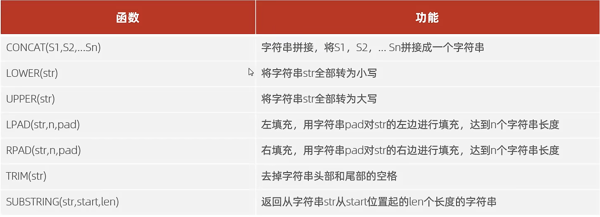
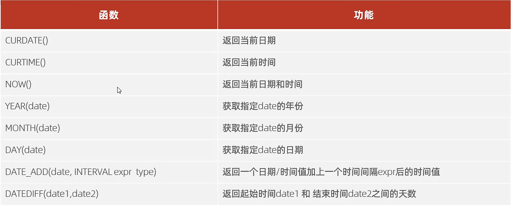
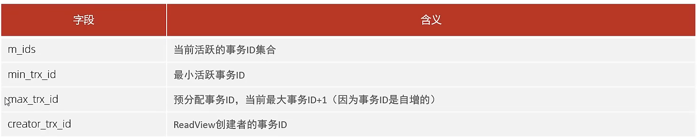

# MYSQL

## 基础概念

数据库（DB）：存储数据的仓库，数据是有组织的进行存储

数据库管理系统（DBMS）：操纵和管理数据库的大型软件

SQL：操作关系型数据库的编程语言，定义了一套操作关系型数据库同一标准

关系型数据库（RDBMS）：建立在关系模型基础上，由多张相互连接的二维表组成的数据库

Mysql数据库模型：数据库和表

**通过表来存储数据的数据库称之为关系型数据库，反之为非关系型数据库**

## SQL语句

😀通用语法

1. SQL数据可以单行或者多行书写，以分号结尾
2. SQL语句可以使用空格/缩进来增强语句的可读性
3. MySQL数据库的SQL语句不区分大小写，关键字建议使用大写
4. 注释：单行注释：`--`或`#`，多行注释`/*注释内容*/`

### DDL

😀Data definition language: 数据定义语言，用来定义数据库对象（数据库，表，字段）

1. 数据库操作

   ```mysql
   #查询所有数据库
   SHOW DATABASES;
   #查询当前数据库
   SELECT DATABASE();
   #创建
   CREATE DATABASE [IF NOT EXISTS] 数据库名 [DEFAULT CHARSET 字符集] [COLLATE 排序规则];
   #删除
   DROP DATABASE [IF EXISTS] 数据库名;
   #使用
   USE 数据库名；
   ```

2. 表操作

   ```mysql
   #查询所有表
   SHOW TABLES;
   #查询表结构
   DESC 表名;
   #查询指定表的建表语句
   SHOW CREATE TABLE 表名;
   #表创建
   CREATE TABLE 表名{
   	字段1 字短1类型 [comment 字段1注释],
   	字段2 字短2类型 [comment 字段2注释],
   	字段3 字短3类型 [comment 字段2注释],
   	...
   	字段n 字短n类型 [comment 字段n注释],
   }[comment 表注释]；
   #表修改--添加字段
   ALTER TABLE 表名 ADD 字段名 类型（长度） [COMMENT 注释] [约束]；
   #表修改--修改数据类型
   ALTER TABLE 表名 MODIFY 字段名 新数据类型（长度）；
   #表修改--修改字段名和字段类型
   ALTER TABLE 表名 CHANGE 旧字段名 新字段名 类型（长度） [COMMENT 注释] [约束]；
   #表修改--删除字段
   ALTER TABLE 表名 DROP 字段名
   #表修改--修改表名
   ALTER TABLE 表名 RENAME TO 新表名；
   #表修改--删除表
   DROP TABLE [IF EXISTS] 表名；
   #表修改--删除指定表，并重新创建该表
   TRUNCATE TABLE 表名；
   ```

   

3. 数据类型

   MySQL中的数据类型有很多，主要分为三类

   数值类型

   

   **123.45：精度为5，标度为2，即0.45，score double(4,1)**

   字符串类型

   

   日期类型

   

### DML

😀Data Manipulation Language: 数据库操作语言，用来对数据库表中的数据进行增删改操作

```mysql
# DML-添加数据
# 1. 给指定字段添加数据
INSERT INTO 表名(字段名1，字段名2，...) VALUES(值1，值2，...)；
# 2. 给全部字段添加数据
INSERT INTO 表名 VALUES(值1，值2，...);
# 3. 批量添加数据
INSERT INTO 表名(字段名1，字段名2，...) VALUES(值1，值2，...)，(值1，值2，...)，(值1，值2，...)；
INSERT INTO 表名 VALUES(值1，值2，...)，VALUES(值1，值2，...)，VALUES(值1，值2，...);
/*
注意：1.  插入数据时，指定的字段顺序需要与值的顺序是一一对应的。2.  字符串和日期型数据应该包含在引号中。3.  插入的数据大小，应该在字段的规定范围内。
*/
# DML-修改数据
UPDATE 表名 SET 字段名1=值1，字段名2=值2，...[WHERE 条件];
/*
注意：修改的语句条件可以有也可以没有，如果没有，则会修改整张表的所有数据
*/

# DML-删除数据
DELETE FROM 表名 [WHERE 条件]
/*
1. DELETE语句的条件可以有，也可以没有，如果没有条件，则会删除整张表所有的数据
2. delete语句不能够删除某一个字段的值（可以用UPDATE）
*/

```

### DQL

😀Data  Query Language: 数据库查询语言，用来查询数据库中表的记录

语法

```mysql
SELECT
	字段列表 #4
FROM
	表名列表 #1
WHERE
	条件列表 #2
GROUP BY
	分组字段列表#3
HAVING
	分组后条件列表
ORDER BY
	排序字段列表#5
LIMIT
	分页参数#6
```

- 基本查询

  ```mysql
  # 1. 查询返回多个字段
  SELECT 字段1，字段2，字段3 ... FROM 表名;
  SELECT * FROM 表名;
  # 2. 设置别名
  SELECT 字段1 [AS 别名1]，字段2 [AS 别名2]，字段3 [AS 别名3]... FROM 表名;
  # 3. 去除重复记录
  SELECT DISTINCT 字段列表 FROM 表名；
  ```

- 条件查询(WHERE)

  ```mysql
  SELECT 字段列表 FROM 表名 WHERE 条件列表；
  ```

  条件

  

  

- 聚合函数(count、max、min、avg、sum)

  ```mysql
  SELECT 聚合函数(字段列表) FROM 表名；
  /*
  null值不参与所有聚合函数运算
  */
  ```

  常见函数

  

- 分组查询(GROUP BY)

  ```mysql
  SELECT 字段列表 FROM 表名 [WHERE 条件] GROUP BY 分组字段名 [HAVING 分组后过滤条件];
  ```

  😁`where`和`having`区别

  1. 执行时机不同：where是分组之前进行过滤，不满组where条件，不参与分组；having是对分组之后对结果进行过滤。
  2. 判断条件不同：where不能对聚合函数进行判断，having 可以

  执行顺序：where>聚合函数>having

  分组之后，查询的字段一般为聚合函数和分组字段，查询其他字段无任何意义

- 排序查询(ORDER BY)

  ```mysql
  SELECT 字段列表 FROM 表名 ORDER BY 字段1 排序方式1，字段2 排序方式2;
  ```

  😀排序方式：

  1. ASC ：升序（默认值）

  2. DESC：降序

     **注意：如果是多字段排序，当第一个字段值相同时，才会根据第二个字段进行排序**

- 分页查询(LIMIT)

  ```mysql
  SELECT 字段列表 FROM 表名 LIMIT 起始索引，查询记录数;
  ```

  😀注意

  1. 起始索引从0开始，起始索引 = （查询页码 -1）* 每页显示记录数
  2. 分页查询时数据库的方言，不同的数据库有不同的实现，MYSQL中是LIMIT
  3. 如果查询的是第一页数据，起始页可以省略，直接简写LIMIT 10

### DCL

😀数据库控制语言，用来创建数据库用户、控制数据库的访问权限

```mysql
#1. 查询用户
USE mysql;
SELECT * FROM user;
#2. 创建用户
CREATE USER 'username'@'hostname' IDENTIFIED BY 'PASSWORLD';
#3. 修改用户密码
ALTER USER 'username'@'hostname'  IDENTIFIED WITH mysql_native_password BY 'NEW_PASSWORD';
#4. 删除用户
DROP USER 'username'@'hostname' 
```

**注意：主机名可以使用%通配**

权限控制

```mysql
# 查询权限
SHOW GRANTS FOR '用户名'@'主机名' ;
# 授予权限
GRANT 权限列表 ON 数据库名.表名 TO '用户名'@'主机名';
# 撤销权限
REVOKE 权限列表 ON 数据库名.表名 FROM '用户名'@'主机名';
```


**• 多个权限之间，使用逗号分隔 **

**• 授权时， 数据库名和表名可以使用 * 进行通配，代表所有。**

## 函数

### 字符串函数

```mysql
SELECT 函数（参数）
```


常用内置函数



### 数值函数

常用数值函数


### 日期函数

常用日期函数



### 流程函数

在SQL中实现条件筛选，从而提高语句效率


## 约束

😀概念：约束是作用于表中字段上的规则，用于限制存储在表中的数据

😀目的：保证数据库中数据的正确、有效性和完整性

😀分类：


**约束是作用于表中字段上的，可以在创建表/修改表的时候添加约束**

### 外键约束

😀外键用来让两张表的数据建立连接，从而保证数据的一致性和完整性

```mysql
#添加外键
CREATE TABLE 表名(
字段名 数据类型,
...
[CONSTRAINT] [外键名称] FOREIGN KEY (外键字段名) REFERENCES 主表 (主表列名)
);


ALTER TABLE 表名 ADD CONSTRAINT 外键名称 FOREIGN KEY (外键字段名) REFERENCES 主表 (主表列名) ;
# 删除外键
ALTER TABLE 表名 DROP FOREIGN KEY 外键名称;
```

😀删除/更新行为


```mysql
ALTER TABLE 表名 ADD CONSTRAINT 外键名称 FOREIGN KEY (外键字段) REFERENCES 主表名 (主表字段名) ON UPDATE CASCADE ON DELETE CASCADE;
```

## 多表查询

### 多表关系

1. 一对多（多对一）

   - 案例：部门与员工关系
   - 关系：一个部门对应多个员工，一个员工对应一个部门
   - 实现：在多的一方建立外键，指向一的一方的主键

   

2. 多对多

   - 案例：学生与课程的关系
   - 关系：一个学生可以选择多门课程，一门课程可以提供多个学车选择
   - 实现：建立第三张中间表，中间表至少包含两个外键，分别关联两方主键

   

3. 一对一

   - 案例：用户与用户详细信息的关系
   - 关系：一对一关系，多用于单表拆分，将一张表的基础字段放在一张表中，其他信息放在另一张表中，以提升操作效率
   - 实现：在任意一方加入外键，关联另一方的主键，并且设置外键唯一的(UNIQUE)

   

​	

### 多表查询

😊概述：指从多张表中查询数据

😊笛卡尔积： 笛卡尔乘积是指在数学中，两个集合A集合 和 B集合的所有组合情况。（在多表查询时，需要消除无效的笛卡尔积）``

😊查询分类：

1. 连接查询
   - 内连接：相当于查询A,B交集部分
   - 外连接：
     - 左外连接：查询左表所有数据，以及两张表交集部分数据
     - 右外连接：查询右表所有数据，以及两张表交集部分数据
   - 自连接：当前表与自身连接查询，自连接必须使用表别名
2. 子查询

### 内连接

```mysql
#隐式内连接
SELECT 字段列表 FROM 表一，表二 WHERE 条件...
#显示内连接
SELECT 字段列表 FROM 表一 [INNER] JOIN 表二 ON 连接条件...
```

### 外连接

```mysql
#左外连接
SELECT 字段列表 FROM 表1 LEFT [ OUTER ] JOIN 表2 ON 条件 ... ;
#右外连接
SELECT 字段列表 FROM 表1 RIGHT [ OUTER ] JOIN 表2 ON 条件 ... ;
```

### 自连接

```mysql
SELECT 字段列表 FROM 表A 别名A JOIN 表A 别名B ON 条件...
```

****

**自连接查询，可以是内连接查询，也可以是外连接查询**

### 联合查询-UNION,UNION ALL

对于UNION查询，是把多次查询结果合并起来，形成一个新的查询结果集

```mysql
SELECT 字段列表 FROM 表A ...
UNION [ ALL ]
SELECT 字段列表 FROM 表B ....;
```

**对于联合查询的多张表的列数必须保持一致，字段类型也需要保持一致*

**union all 会将全部的数据直接合并一起，union会对合并后是数据去重**

### 子查询

😊概念：SQL语句中嵌套SELECT语句，称为嵌套查询，又称子查询

```mysql
SELECT * FROM t1 where column1 = (SELECT column1 FROM t2);
```

**子查询外部的语句可以是INSERT/UPDATE/DELETE/SELECT中的任何一个**

😊根据查询结果不同，分为：

1. 标量子查询（子查询结果为单个值）

   常用的操作符: = <> > >= < <=

2. 列子查询（子查询结果为一列）

   常用的操作符: IN, NOT IN, ANY,SOME,ALL

   

3. 行子查询（子查询结果为一行）

   常用操作符: =,<>,IN,NOT IN

4. 表子查询（子查询结果为多行多列）

   常用操作符: IN

😊根据子查询位置,分为:WHERE之后,FROM之后,SELECT之后

## 事务

😊简介: 事务是一组操作的集合,它是一个不可分割的工作单位,事务会把所有的操作作为一个整体一起向系统提交或者撤销操作请求,即这些操作要么同时成功,要么同时失败

### 事务操作

```mysql
方式一
#查看/设置事务提交方式
SELECT @@autocommit;
SET @@autocommit = 0; #当前会话,手动提交
#提交事务
COMMIT;
#回滚事务
ROLLBACK;

方式二
#开启事务
START TRANSACTION 或 BEGIN
#提交事务
COMMIT;
#回滚事务
ROLLBACK;

```

### 事务的四大特性

- 原子性（Atomicity）：事务是不可分割的最小单元，要么全部成功，要么全部失败
- 一致性（Consistency）：事务完成时，必须使所有的数据都保持一致状态
- 隔离性（Isolation）：数据库系统提供的隔离机制，保证事务在不受外部并发操作影响的独立环境下运行
- 持久性（Durability）：事务一旦提交或回滚，它对数据库中的数据的改变就是永久的

### 并发事务问题

😊脏读：一个事务读到另一个事务还没提交的数据

😊不可重复读：一个事务先后读取同一条记录 ，但两次读取的数据不同，称之为不可重复读

😊幻读：一个事务按照条件查询数据时，没有对应的数据行，但是在插入数据时，又发现这行数据已经存在，好像出现了幻影

### 事务的隔离级别


```mysql
-- 查看事务隔离级别
SELECT @@TRANSACTION_ISOLATION;

-- 设置事务隔离级别
SET [ SESSION | GLOBAL ] TRANSACTION ISOLATION LEVEL { READ UNCOMMITTED |
READ COMMITTED | REPEATABLE READ | SERIALIZABLE }
```

## 存储引擎

### MySQL体系结构图


- 连接层

  最上层时一些客户端和链接服务，主要完成一些类似于连接处理、授权认证、及相关的安全方案。服务器也会为安全接入的每个客户端验证它所具有的操作权限

- 服务层

  第二层架构主要完成大多数的核心服务功能，如SQL接口，并完成缓存的查询，SQL的分析和优化，部分内置函数的执行。所有跨存储引擎的功能也在这一层实现，如过程、函数等。

- 引擎层

  存储引擎真正的负责了MySQL中数据的存储和提取，服务器通过API和存储引擎进行通信。不同的存储引擎具有不同的功能，这样我们可以根据自己的需要，来选取合适的存储引擎

- 存储层

  早就将数据存储在文件系统之上，并完成与存储引擎的交互

### 存储引擎简介

😀存储引擎就是存储数据，建立索引、更新、查询数据等技术的实现方式。存储引擎是基于表的，而不是基于库的，所以存储引擎也可以被称为表类型

```mysql
# 创建表时指定存储引擎
CREATE TABLE 表名(
字段1 字段1类型 [ COMMENT 字段1注释 ] ,
......
字段n 字段n类型 [COMMENT 字段n注释 ]
) ENGINE = INNODB [ COMMENT 表注释 ] ;
# 查看当前数据库支持的存储引擎
show engines;
```

### 存储引擎特点

1. InnoDB

   该引擎是一种兼顾高可靠性和高性能的通用存储引擎，其特点是

   - DML操作遵循ACID模型，支持**事务**；
   - **行级锁**。提高并发访问性能
   - 支持**外键**FOREIGN KEY约束，保证数据的完整性和正确性
   - 文件，xxx.ibd：xxx代表的是表名，innoDB引擎的每张表都会对应这样一个表空间文件，存储该表的表结 构（frm-早期的 、sdi-新版的）、数据和索引。

   

2. MyISAM

   该引擎是早期的默认存储引擎，其特点是

   - 不支持事务，不支持外键
   - 支持表锁，不支持行锁
   - 访问速度快
   - 文件，xxx.sdi：存储表结构信息 xxx.MYD: 存储数据 xxx.MYI: 存储索引

3. Memory

   该引擎的表数据是存储咋内存中的，由于受到硬件问题、或断电问题的影响，只能将这些表作为临时表或缓存使用

   - 内存存放
   - HASH索引
   - 文件，xxx.sdi：存储表结构信息


## 索引**

### 概述

😀帮助MySQL高效获取数据的数据结构（有序）。在数据之外，数据库还维护着满足特定查找算法的数据结构，这些数据结构以某种方式引用（指向）数据，这样就可以在这些数据结构上实现高级查找算法，这种数据结构就是索引


### 索引结构

MySQL的索引是在存储引擎实现的，不同的存储引擎有不同的结构，主要包含一下几种


- B-Tree(多路平衡查找树)

  以一个最大度数（max-degree）为5（5阶）的b-tree为例（每个结点最多存储4个key，5个指针）

  [B-Tree Visualization (usfca.edu)](https://www.cs.usfca.edu/~galles/visualization/BTree.html)

  

- B+Tree

  以一颗最大度数（max-degree）为4（4阶）的B+Tree为例

  

  与B-Tree区别

  1. 所有的数据都会出现在叶子节点
  2. 叶子节点形成一个单向链表

  MySQL索引数据结构对经典的B+Tree进行了优化，在原B+Tree的基础上，增加一个指向相邻子叶子节点的链表指针，就形成了带有顺序指针的B+Tree,提高区间访问性能

  

- Hash

  哈希索引就是采用一定的hash算法，将键值换算成新的hash值，映射到对应的槽位上，然后存储在hash表中

  特点：

  1. Hash所有只能用于对等比较（=，in）,不支持范围查询（between,>,<,...）
  2. 无法利用索引完成排序操作
  3. 查询效率高，通常只需要一次索引就可以了，效率通常要高于B+Tree索引

  存储引擎支持

  memory引擎支持，InnoDB中具有自适应hash功能，hash索引是存储引擎根据B+Tree索引在指定条件下自动构建的

- 思考，InnoDB存储引擎选择使用B+tree索引结构

  1. 相对于二叉树，层级更少，搜索效率高
  2. 对于B+tree，无论是叶子节点还是非叶子节点，都会保存数据，这样导致一页中存储的键值减少，指针跟着减少，套同样保存大量数据，只能增减树的高度，导致性能降低
  3. 相对于Hash索引，B+Tree支持范围匹配及排序操作

### 索引分类


根据InnoDB存储引擎中，根据索引的存储形式，又可以分为以下两种


聚集索引选取规则：

- 如果存在主键，主键索引就是聚集索引
- 如果不存在主键，将使用第一个唯一（UNIQUE）索引作为聚集索引
- 如果表没有主键，也没有合适的唯一索引，则InnoDB会自动生成一个rowid作为隐藏的聚集索引


**InnoDB主键索引的B+Tree高度为多高**

假设：一行数据大小为1K，一页中可以存储16行这样的数据。InnoDB的指针占用6个字节的空间，主键即使为bigint，占用字节数为8

高度为2：

n\*8 + (n+1)\*6 = 16*1024,算出n约为1170

1170 \* 16 = 18736

高度为3：

1171\*1171\*16 = 21939856

### 索引语法

```mysql
# 创建索引
CREATE [UNIQUE | FULLTEXT] INDEX index_name ON table_name (index_col_name,...);
# 查看索引
SHOW INDEX FROM table_name
# 删除索引
DROP INDEX index_name ON table_name

```

### SQL性能分析

```mysql
# SQL执行频率
show [session | global] status
SHOW GLOBAL STATUS LIKE 'Com_______';
```

😀慢查询日志：记录了所有执行时间超过指定参数（long_query_time，单位：秒，默认10秒）的所有SQL语句的日志。MySQL默认不开启，需要在MySQL的配置文件（/etc/my.cnf）中配置如下信息：

```mysql
-- 开启MySQL慢查询日志开关
slow_query_log = 1;
# 设置慢日志的时间为2秒，SQL语句执行时间超过2s，就会视为慢查询，记录慢查询日志
long_query_time = 2;
# 配置完毕后，通过一下指令重新启动MySQL服务器进行测试，查看慢日志文件中记录的信息/var/lib/mysql/localhost_slow.log

```

😀profile详情：show profiles能够在做SQL优化时帮助我们了解时间都消耗在哪。通过have_profiling参数，能够看到当前MySQL是否支持profile操作

```mysql
# 查询是否支持
select @@have_profiling;
# 默认是关闭的，通过set session/global开启profiling
set profiling=1;
# 查看每一条SQL的耗时基本情况
show profiles;
# 查看指定query_id的SQL语句各个阶段的耗时情况
show profile for query query_id;
#查看指定query_id的SQL语句CPU的使用情况
show profile cpu for query query_id;
```

😀explain执行计划：EXPLAIN或者DESC命令获取MySQL如何执行SELECT语句的信息，包括SELECT语句执行过程中表如何连接和连接的顺序

```mysql
# 直接在select语句之前加上关键字explain / desc
EXPLAIN SELECT 字段列表 FROM 表名 WHERE 条件;
```


1. id：select 查询的序列号，表示查询中执行select子句或者是操作表的顺序（id相同，执行顺序从上到下；id不同，值越大，越先执行）
2. select_type：表示 SELECT 的类型，常见的取值有 SIMPLE（简单表，即不使用表连接 或者子查询）、PRIMARY（主查询，即外层的查询）、 UNION（UNION 中的第二个或者后面的查询语句）、 SUBQUERY（SELECT/WHERE之后包含了子查询）等
3. **type**：表示连接类型，性能由好到差的连接类型为NULL、system、const、 eq_ref、ref、range、 index、all 。
4. **possible_key**：显示可能应用在这张表上的索引，一个或多个。
5. **key** ：实际使用的索引，如果为NULL，则没有使用索引。
6. **key_len**： 表示索引中使用的字节数， 该值为索引字段最大可能长度，并非实际使用长 度，在不损失精确性的前提下， 长度越短越好 。
7. rows： MySQL认为必须要执行查询的行数，在innodb引擎的表中，是一个估计值， 可能并不总是准确的
8. filtered： 表示返回结果的行数占需读取行数的百分比， filtered 的值越大越好。

### 索引使用

```mysql
# 在未建立索引之前，执行如下SQL语句，查看SQL的耗时
SELECT * FROM tb_sku WHERE sn = '100000003145001'; #20s
# 针对字段创建索引
create index idx_sku_sn on tb_sku(sn) ;
# 然后执行相同的SQL语句，再次查看SQL的耗时
SELECT * FROM tb_sku WHERE sn = '100000003145001';#0.01s

```

😀最左前缀法则：如果索引了多列（联合索引），要遵守最左前缀法则。最左前缀法则指的是查询从索引的最左列开始， 并且不跳过索引中的列。如果跳跃某一列，索引将会部分失效(后面的字段索引失效)。

😀范围查询：联合索引中，出现范围查询（>,<）,范围查询右侧的列索引失效

😀索引列运算：不要在索引列上进行运算操作，索引将失效

😀字符串不加单引号，索引失效

😀模糊查询：如果仅仅是尾部模糊匹配，索引不会失效。如果是头部模糊匹配，索引失效

😀or连接的条件：用or分隔开的条件，如果or前的条件中的列有索引，而后面的列没有索引，那么涉及的索引都不会被用到

😀数据分布影响：如果MySQL评估使用索引比全表更慢，则不使用索引

### 使用规则

😀SQL提示，是优化数据库的一个重要手段，简单来说，就是在SQL语句中加入一些人为的提示来达到优化操作的目的

```mysql
# use index
explain select * from tb_user use index(idx_user_pro) where profession = '软件工程';
# ignore index
explain select * from tb_user ignore index(idx_user_pro) where profession = '软件工程';
# force index
explain select * from tb_user force index(idx_user_pro) where profession = '软件工程';

```

😀覆盖索引：尽量使用覆盖索引（查询使用了索引，并且需要返回的列，在该索引中已经全部能够得到），减少select *。

```mysql
# Using index condition: 查找使用了索引，但是需要回表查询数据
# Using where; Using Index: 查找使用了索引，但是需要的数据都在索引列中能找到，所以不需要回表查询数据
```


😀当字段类型为字符串（varchar，text，longtext等）时，有时候需要索引很长的字符串，这会让 索引变得很大，查询时，浪费大量的磁盘IO， 影响查询效率。此时可以只将字符串的一部分前缀，建 立索引，这样可以大大节约索引空间，从而提高索引效率。

```mysql
create index idx_xxx on table_name(column);
```

前缀长度：可以根据索引的选择性来决定，而选择性是指不重复的索引值（基数）和数据表的记录总数的比值，索引值选择性越高则查询效率越高，唯一索引的选择性是1，这是最好的索引选择性，性能也是最好的

```mysql
select count(distinct email)/ count(*) from tb_user;
select count(distinct substring(email,1,5))/count(*) from tb_user;
```

😀单列索引与联合索引

单列索引：即一个索引只包含单个列

联合索引：即一个索引包含多个列

**如果存在多个查询条件，建议建立联合索引**

😀设计原则

1. 针对于数据量较大，且查询比较频繁的表建立索引。
2. 针对于常作为查询条件（where）、排序（order by）、分组（group by）操作的字段建立索 引。 
3.  尽量选择区分度高的列作为索引，尽量建立唯一索引，区分度越高，使用索引的效率越高。 
4.  如果是字符串类型的字段，字段的长度较长，可以针对于字段的特点，建立前缀索引。 
5.  尽量使用联合索引，减少单列索引，查询时，联合索引很多时候可以覆盖索引，节省存储空间， 避免回表，提高查询效率。 
6.  要控制索引的数量，索引并不是多多益善，索引越多，维护索引结构的代价也就越大，会影响增 删改的效率。 
7.  如果索引列不能存储NULL值，请在创建表时使用NOT NULL约束它。当优化器知道每列是否包含 NULL值时，它可以更好地确定哪个索引最有效地用于查询。

## SQL优化

### 插入数据

😀insert优化

```mysql
# 批量插入
insert into tb_tes values(1,'Tom'),(2,'Cat'),(1,'jerry');
# 手动提交事务
start transaction;
insert into tb_tes values(1,'Tom'),(2,'Cat'),(1,'jerry');
insert into tb_test values(1,'Tom'),(2,'Cat'),(3,'Jerry');
insert into tb_test values(4,'Tom'),(5,'Cat'),(6,'Jerry');
insert into tb_test values(7,'Tom'),(8,'Cat'),(9,'Jerry');
commit;
# 主键顺序插入
# 主键乱序插入 : 8 1 9 21 88 2 4 15 89 5 7 3
# 主键顺序插入 : 1 2 3 4 5 7 8 9 15 21 88 89

# 大批量插入数据 ：load指令
-- 客户端连接服务端时，加上参数 -–local-infile
mysql –-local-infile -u root -p
-- 设置全局参数local_infile为1，开启从本地加载文件导入数据的开关
set global local_infile = 1;
-- 执行load指令将准备好的数据，加载到表结构中
load data local infile '/root/sql1.log' into table tb_user fields
terminated by ',' lines terminated by '\n' ;

```

### 主键优化

😀在InnoDB存储引擎中，表数据都是根据主键顺序组织存放的，这种存储方式的表称为索引组织表 (index organized table IOT)。

1. 页分裂：页可以为空，也可以填充一半，每个页包含了2-N行数据（如果一行数据过大，会行溢出），根据主键排列。

2. 页合并：当删除一行记录时，实际上记录并没有被物理删除，只是记录被标记（flaged）为删除并且它的空间 变得允许被其他记录声明使用。当页中删除的记录达到 MERGE_THRESHOLD（默认为页的50%），InnoDB会开始寻找最靠近的页（前 或后）看看是否可以将两个页合并以优化空间使用

   

😀主键设计原则：

- 满足业务需求的情况下，尽量降低主键的长度。 
- 插入数据时，尽量选择顺序插入，选择使用AUTO_INCREMENT自增主键。
-  尽量不要使用UUID做主键或者是其他自然主键，如身份证号。
-  业务操作时，避免对主键的修改。

### order by优化

1. Using filesort ：通过表的索引或全表扫描，读取满足条件的数据行，然后在排序缓冲区sort buffer中完成排序操作，所有不是通过索引直接返回排序结果的排序都叫 FileSort 排序。
2. Using index : 通过有序索引顺序扫描直接返回有序数据，这种情况即为 using index，不需要 额外排序，操作效率

😀优化原则

1. 根据排序字段建立合适的索引，多字段排序时，也遵循最左前缀法则。 
2.  尽量使用覆盖索引。 
3.  多字段排序, 一个升序一个降序，此时需要注意联合索引在创建时的规则（ASC/DESC）
4.  如果不可避免的出现filesort，大数据量排序时，可以适当增大排序缓冲区大小 sort_buffer_size(默认256k)。

### group by优化

在分组操作中，我们需要通过以下两点进行优化，以提升性能： 

1. 在分组操作时，可以通过索引来提高效率。 
2.  分组操作时，索引的使用也是满足最左前缀法则的。

### limit 优化

在数据量比较大时，如果进行limit分页查询，在查询时，越往后，分页查询效率越低。

优化思路: 一般分页查询时，通过创建 覆盖索引 能够比较好地提高性能，可以通过覆盖索引加子查 询形式进行优化。

### count优化

优化思路：自己计数


**按照效率排序的话，count(字段) < count(主键 id) < count(1) ≈ count(*)，所以尽 量使用 count(*)。**

### update优化

当我们开启多个事务，在执行上述的SQL时，我们发现行锁升级为了表锁。 导致该update语句的性能 大大降低。InnoDB的行锁是针对索引加的锁，不是针对记录加的锁 ,并且该索引不能失效，否则会从行锁 升级为表锁 。

## 视图/存储过程/触发器

### 视图

😀视图（view）是一种虚拟存在的表。视图中的数据并不在数据库中实际存在，行和列数据来自定义视 图的查询中使用的表，并且是在使用视图时动态生成的。 通俗的讲，视图只保存了查询的SQL逻辑，不保存查询结果。所以我们在创建视图的时候，主要的工作 就落在创建这条SQL查询语句上。

```mysql
# 创建视图
CREATE [OR REPLACE] VIEW 视图名称[(列名列表)] AS SELECT语句 [ WITH [CASCADED | LOCAL ] CHECK OPTION ]
#查看创建视图语句：
SHOW CREATE VIEW 视图名称;
#查看视图数据：
SELECT * FROM 视图名称 ...... ;
#方式一：
CREATE [OR REPLACE] VIEW 视图名称[(列名列表)] AS SELECT语句 [ WITH [ CASCADED | LOCAL ] CHECK OPTION ]
# 方式二：
ALTER VIEW 视图名称[(列名列表)] AS SELECT语句 [ WITH [ CASCADED | LOCAL ] CHECK OPTION ]
# 删除视图
DROP VIEW [IF EXISTS] 视图名称 [,视图名称] ...
```

😀当使用WITH CHECK OPTION子句创建视图时，MySQL会通过视图检查正在更改的每个行，例如 插 入，更新，删除，以使其符合视图的定义。 MySQL允许基于另一个视图创建视图，它还会检查依赖视 图中的规则以保持一致性。为了确定检查的范围，mysql提供了两个选项： CASCADED 和 LOCAL ，默认值为 CASCADED 。

CASCADED：级联。 比如，v2视图是基于v1视图的，如果在v2视图创建的时候指定了检查选项为 cascaded，但是v1视图 创建时未指定检查选项。 则在执行检查时，不仅会检查v2，还会级联检查v2的关联视图v1。

LOCAL ：本地。 比如，v2视图是基于v1视图的，如果在v2视图创建的时候指定了检查选项为 local ，但是v1视图创 建时未指定检查选项。 则在执行检查时，知会检查v2，不会检查v2的关联视图v1

😀视图的更新：要使视图可更新，视图中的行与基础表中的行之间必须存在一对一的关系。如果视图包含以下任何一 项，则该视图不可更新：

```mysql
# A. 聚合函数或窗口函数（SUM()、 MIN()、 MAX()、 COUNT()等）
# B. DISTINCT
# C. GROUP BY
# D. HAVING
# E. UNION 或者 UNION ALL
```

😀视图作用

1.  简单 视图不仅可以简化用户对数据的理解，也可以简化他们的操作。那些被经常使用的查询可以被定义为视 图，从而使得用户不必为以后的操作每次指定全部的条件。
2.  安全 数据库可以授权，但不能授权到数据库特定行和特定的列上。通过视图用户只能查询和修改他们所能见 到的数据
3.  数据独立 视图可帮助用户屏蔽真实表结构变化带来的影响。

### 存储过程

😀介绍：存储过程是事先经过编译并存储在数据库中的一段 SQL 语句的集合，调用存储过程可以简化应用开发 人员的很多工作，减少数据在数据库和应用服务器之间的传输，对于提高数据处理的效率是有好处的。 存储过程思想上很简单，就是数据库 SQL 语言层面的代码封装与重用。

😀特点：封装，复用，可以接受参数，也可以返回数据，减少网络交互，效率提升

```mysql
# 创建
CREATE PROCEDURE 存储过程名称 ([ 参数列表 ])
BEGIN
-- SQL语句
END ;
# 调用
CALL 名称 ([ 参数 ]);
# 查看
SELECT * FROM INFORMATION_SCHEMA.ROUTINES WHERE ROUTINE_SCHEMA = 'xxx'; -- 查询指定数据库的存储过程及状态信息
SHOW CREATE PROCEDURE 存储过程名称 ; -- 查询某个存储过程的定义
# 删除
drop procedure if exists 存储过程名称 ；
## 指定SQL语句结束符
delimiter $$
```

😀变量

```mysql
# 系统变量 是MySQL服务器提供，不是用户定义的，属于服务器层面。分为全局变量（GLOBAL）、会话变量（SESSION）。
# 查看系统变量
SHOW [ SESSION | GLOBAL ] VARIABLES ; -- 查看所有系统变量
SHOW [ SESSION | GLOBAL ] VARIABLES LIKE '......'; -- 可以通过LIKE模糊匹配方式查找变量
SELECT @@[SESSION | GLOBAL] 系统变量名; -- 查看指定变量的值

# 设置系统变量
SET [ SESSION | GLOBAL ] 系统变量名 = 值 ;
SET @@[SESSION | GLOBAL]系统变量名 = 值 ;

#用户自定义变量：用户变量不用提前声明，在用的时候直接用 "@变量名" 使用就可以。其作用域为当前连接
# 赋值
SET @var_name = expr [, @var_name = expr] ... ;
SET @var_name := expr [, @var_name := expr] ... ;

SELECT @var_name := expr [, @var_name := expr] ... ;
SELECT 字段名 INTO @var_name FROM 表名;
#使用
SELECT @var_name ;
# 局部变量：是根据需要定义的在局部生效的变量，访问之前，需要DECLARE声明。可用作存储过程内的局部变量和输入参数，局部变量的范围是在其内声明的BEGIN ... END块。
# 声明
DECLARE 变量名 变量类型 [DEFAULT ... ] ;
# 赋值
SET 变量名 = 值 ;
SET 变量名 := 值 ;
SELECT 字段名 INTO 变量名 FROM 表名 ... ;

```

😀流程控制

```mysql
# if 用于做条件判断，具体的语法结构为：
IF 条件1 THEN
.....
ELSEIF 条件2 THEN -- 可选
.....
ELSE -- 可选
.....
END IF;
# case
# 语法一
CASE case_value
    WHEN when_value1 THEN statement_list1
    [ WHEN when_value2 THEN statement_list2] ...
    [ ELSE statement_list ]
END CASE;
# 语法二
CASE
    WHEN search_condition1 THEN statement_list1
    [WHEN search_condition2 THEN statement_list2] ...
    [ELSE statement_list]
END CASE;


```

😀参数


```mysql
# 用法
CREATE PROCEDURE 存储过程名称 ([ IN/OUT/INOUT 参数名 参数类型 ])
BEGIN
-- SQL语句
END ;
```

😀循环

```mysql
-- while
-- 先判定条件，如果条件为true，则执行逻辑，否则，不执行逻辑
WHILE 条件 DO
	SQL逻辑...
END WHILE;

-- repeat 
-- repeat是有条件的循环控制语句, 当满足until声明的条件的时候，则退出循环 。具体语法为：
REPEAT
    SQL逻辑...
    UNTIL 条件
END REPEAT;

-- loop 
-- LOOP 实现简单的循环，如果不在SQL逻辑中增加退出循环的条件，可以用其来实现简单的死循环。
-- LEAVE ：配合循环使用，退出循环。
-- ITERATE：必须用在循环中，作用是跳过当前循环剩下的语句，直接进入下一次循环。
[begin_label:] LOOP
    SQL逻辑...
END LOOP [end_label];
LEAVE label; -- 退出指定标记的循环体
ITERATE label; -- 直接进入下一次循环

```

😀游标cursor：是用来存储查询结果集的数据类型 , 在存储过程和函数中可以使用游标对结果集进 行循环的处理。游标的使用包括游标的声明、OPEN、FETCH 和 CLOSE，其语法分别如下。

```mysql
# 声明游标
DECLARE 游标名称 CURSOR FOR 查询语句 ;
# 打开游标
OPEN 游标名称 ;
# 获取游标记录
FETCH 游标名称 INTO 变量 [, 变量 ] ;
# 关闭游标
close 游标名称
```

😀条件处理程序：可以用来定义在流程控制结构执行过程中遇到问题时相应的处理步骤

```mysql
DECLARE handler_action HANDLER FOR condition_value [, condition_value] ... statement ;
handler_action 的取值：
CONTINUE: 继续执行当前程序
EXIT: 终止执行当前程序
condition_value 的取值：
SQLSTATE sqlstate_value: 状态码，如 02000
SQLWARNING: 所有以01开头的SQLSTATE代码的简写
NOT FOUND: 所有以02开头的SQLSTATE代码的简写
SQLEXCEPTION: 所有没有被SQLWARNING 或 NOT FOUND捕获的SQLSTATE代码的简写
```

😀存储函数：有返回值的存储过程，存储函数的参数只能是IN类型的

```mysql
CREATE FUNCTION 存储函数名称 ([ 参数列表 ])
RETURNS type [characteristic ...]
BEGIN
-- SQL语句
RETURN ...;
END ;
/* characteristic说明：
DETERMINISTIC：相同的输入参数总是产生相同的结果
NO SQL ：不包含 SQL 语句。
READS SQL DATA：包含读取数据的语句，但不包含写入数据的语句。
*/
```

### 触发器

😀描述：触发器是与表有关的数据库对象，指在insert/update/delete之前(BEFORE)或之后(AFTER)，触 发并执行触发器中定义的SQL语句集合。触发器的这种特性可以协助应用在数据库端确保数据的完整性 , 日志记录 , 数据校验等操作 。 使用别名OLD和NEW来引用触发器中发生变化的记录内容，这与其他的数据库是相似的。现在触发器还 只支持行级触发，不支持语句级触发。


语法：

```mysql
# 创建
CREATE TRIGGER trigger_name
BEFORE/AFTER INSERT/UPDATE/DELETE
ON tbl_name FOR EACH ROW -- 行级触发器
BEGIN
trigger_stmt ;
END
# 查看
show triggers;
# 删除
DROP TRIGGER [schema_name.]trigger_name ; -- 如果没有指定 schema_name，默认为当前数据库 。

```


## 锁

😀概述：锁是计算机协调多个进程或线程并发访问某一资源的机制。在数据库中，除传统的计算资源（CPU、 RAM、I/O）的争用以外，数据也是一种供许多用户共享的资源。如何保证数据并发访问的一致性、有 效性是所有数据库必须解决的一个问题，锁冲突也是影响数据库并发访问性能的一个重要因素。从这个 角度来说，锁对数据库而言显得尤其重要，也更加复杂。 

MySQL中的锁，按照锁的粒度分，分为以下三类：

1.  全局锁：锁定数据库中的所有表
2.  表级锁：每次操作锁住整张表
3. 行级锁：每次操作锁住对应的行数据

### 全局锁：

😀对是对整个数据库实例加锁，加锁后整个实例就处于只读状态，后续的DML的写语句，DDL语 句，已经更新操作的事务提交语句都将被阻塞。 其典型的使用场景是做全库的逻辑备份，对所有的表进行锁定，从而获取一致性视图，保证数据的完整性。

```mysql
# 加全局锁
flush tables with read lock ;
# 备份数据
mysqldump -uroot –p1234 itcast > itcast.sql
# 解全局锁
unlock tables;

#在InnoDB引擎中，我们可以在备份时加上参数 --single-transaction 参数来完成不加锁的一致性数据备份。
mysqldump --single-transaction -uroot –p123456 itcast > itcast.sql
```

数据库中加全局锁，是一个比较重的操作，存在以下问题： 

1. 如果在主库上备份，那么在备份期间都不能执行更新，业务基本上就得停摆。 
2. 如果在从库上备份，那么在备份期间从库不能执行主库同步过来的二进制日志（binlog），会导 致主从延迟。

### 表级锁

😀每次操作锁住整张表。锁定粒度大，发生锁冲突的概率最高，并发度最低。应用在MyISAM、 InnoDB、BDB等存储引擎中。

😀对于表级锁，主要分为以下三类： 表锁、 元数据锁（meta data lock，MDL）、 意向锁

表锁 对于表锁，分为两类： 

1. 表共享读锁（read lock） 
2. 表独占写锁（write lock）

```mysql
# 加锁
lock tables 表名... read/write
# 释放锁
unlock tables /客户端断开连接
```

** 读锁不会阻塞其他客户端的读，但是会阻塞写。写锁既会阻塞其他客户端的读，又会阻塞 其他客户端的写，本客户端既可以读也可以写。**

😀元数据锁（meta data lock，MDL） ：MDL加锁过程是系统自动控制，无需显式使用，在访问一张表的时候会自动加上。MDL锁主要作用是维 护表元数据的数据一致性，在表上有活动事务的时候，不可以对元数据进行写入操作。为了避免DML与 DDL冲突，保证读写的正确性。


```mysql
# 查看数据库中的元数据锁的情况：
select object_type,object_schema,object_name,lock_type,lock_duration from performance_schema.metadata_locks ;

```

😀意向锁：为了避免DML在执行时，加的行锁与表锁的冲突，在InnoDB中引入了意向锁，使得表锁不用检查每行 数据是否加锁，使用意向锁来减少表锁的检查。

意向锁分为两种

1. 意向共享锁(IS): 由语句select ... lock in share mode添加 。 与 表锁共享锁 (read)兼容，与表锁排他锁(write)互斥。
2.  意向排他锁(IX): 由insert、update、delete、select...for update添加 。与表锁共 享锁(read)及排他锁(write)都互斥，意向锁之间不会互斥。

**一旦事务提交了，意向共享锁、意向排他锁，都会自动释放。**

```mysql
# 查看意向锁及行锁的加锁情况：
select object_schema,object_name,index_name,lock_type,lock_mode,lock_data from performance_schema.data_locks;
```

### 行级锁

😀概述：每次操作锁住对应的行数据。锁定粒度最小，发生锁冲突的概率最低，并发度最高。应用在 InnoDB存储引擎中。 InnoDB的数据是基于索引组织的，行锁是通过对索引上的索引项加锁来实现的，而不是对记录加的 锁。对于行级锁，主要分为以下三类：

1. 行锁（Record Lock）：锁定单个行记录的锁，防止其他事务对此行进行update和delete。在 RC、RR隔离级别下都支持。

   

   InnoDB实现了以下两种类型的行锁：

   - 共享锁（S）：允许一个事务去读一行，阻止其他事务获得相同数据集的排它锁。
   -  排他锁（X）：允许获取排他锁的事务更新数据，阻止其他事务获得相同数据集的共享锁和排他 锁。

   

   

   默认情况下，InnoDB在 REPEATABLE READ事务隔离级别运行，InnoDB使用 next-key 锁进行搜 索和索引扫描，以防止幻读。 

   - 针对唯一索引进行检索时，对已存在的记录进行等值匹配时，将会自动优化为行锁。 
   - InnoDB的行锁是针对于索引加的锁，不通过索引条件检索数据，那么InnoDB将对表中的所有记 录加锁，此时 就会升级为表锁。

   ```mysql
   # 查看意向锁及行锁的加锁情况：
   select object_schema,object_name,index_name,lock_type,lock_mode,lock_data from performance_schema.data_locks;
   ```

   

2. 间隙锁（Gap Lock）：锁定索引记录间隙（不含该记录），确保索引记录间隙不变，防止其他事 务在这个间隙进行insert，产生幻读。在RR隔离级别下都支持。

   

   默认情况下，InnoDB在 REPEATABLE READ事务隔离级别运行，InnoDB使用 next-key 锁进行搜 索和索引扫描，以防止幻读。 

   - 索引上的等值查询(唯一索引)，给不存在的记录加锁时, 优化为间隙锁 。 
   - 索引上的等值查询(非唯一普通索引)，向右遍历时最后一个值不满足查询需求时，next-key lock 退化为间隙锁。
   -  索引上的范围查询(唯一索引)--会访问到不满足条件的第一个值为止。

   **间隙锁唯一目的是防止其他事务插入间隙。间隙锁可以共存，一个事务采用的间隙锁不会 阻止另一个事务在同一间隙上采用间隙锁。**

3. 临键锁（Next-Key Lock）：行锁和间隙锁组合，同时锁住数据，并锁住数据前面的间隙Gap。 在RR隔离级别下支持。

   

   

## InnoDB引擎

### 逻辑存储结构

😀表空间（ibd文件）：一个mysql实例可以对应多个表空间，用于存储记录、索引等数据

😀段，分为数据段（Leaf node segment）、索引段（Non-leaf node segment）、回滚段 （Rollback segment），InnoDB是索引组织表，数据段就是B+树的叶子节点， 索引段即为B+树的 非叶子节点。段用来管理多个Extent（区）

😀区，表空间的单元结构，每个区的大小为1M。 默认情况下， InnoDB存储引擎页大小为16K， 即一 个区中一共有64个连续的页。

😀页，是InnoDB 存储引擎磁盘管理的最小单元，每个页的大小默认为 16KB。为了保证页的连续性， InnoDB 存储引擎每次从磁盘申请 4-5 个区。

😀行，InnoDB存储引擎数据是按行进行存放的，在行中，默认有两个隐藏字段： 

- Trx_id：每次对某条记录进行改动时，都会把对应的事务id赋值给trx_id隐藏列。 
- Roll_pointer：每次对某条引记录进行改动时，都会把旧的版本写入到undo日志中，然后这个 隐藏列就相当于一个指针，可以通过它来找到该记录修改前的信息。

### 架构

MySQL5.5版本开始，默认使用该引擎，它擅长事务处理，具有崩溃恢复特性，下图左侧为内存结构，右侧为磁盘结构


😀内存结构：


😀磁盘结构：


😀后台线程

- master thread：核心后台线程，负责调度其他线程，还负责将缓冲池中的数据异步刷新到磁盘中, 保持数据的一致性， 还包括脏页的刷新、合并插入缓存、undo页的回收 。

- IO thread：在InnoDB存储引擎中大量使用了AIO来处理IO请求, 这样可以极大地提高数据库的性能，而IO Thread主要负责这些IO请求的回调。

  `show engine innodb status \G;`

  

- purge thread：主要用于回收事务已经提交了的undo log，在事务提交之后，undo log可能不用了，就用它来回 收。

- Page Cleaner Thread ：协助 Master Thread 刷新脏页到磁盘的线程，它可以减轻 Master Thread 的工作压力，减少阻 塞。

### 事务原理


😀redo log：持久性，重做日志，记录的是事务提交时数据页的物理修改，是用来实现事务的持久性。 该日志文件由两部分组成：重做日志缓冲（redo log buffer）以及重做日志文件（redo log file）,前者是在内存中，后者在磁盘中。当事务提交之后会把所有修改信息都存到该日志文件中, 用 于在刷新脏页到磁盘,发生错误时, 进行数据恢复使用。

😀undo log：原子性，回滚日志，用于记录数据被修改前的信息 , 作用包含两个 : 提供回滚(保证事务的原子性) 和 MVCC(多版本并发控制) 。 undo log和redo log记录物理日志不一样，它是逻辑日志。可以认为当delete一条记录时，undo log中会记录一条对应的insert记录，反之亦然，当update一条记录时，它记录一条对应相反的 update记录。当执行rollback时，就可以从undo log中的逻辑记录读取到相应的内容并进行回滚。 Undo log销毁：undo log在事务执行时产生，事务提交时，并不会立即删除undo log，因为这些 日志可能还用于MVCC。 Undo log存储：undo log采用段的方式进行管理和记录，存放在前面介绍的 rollback segment 回滚段中，内部包含1024个undo log segment。

**一致性是由redo log 和undo log共同决定的**

### MVCC

😀基本概念：

- 当前读：读取的是记录的最新版本，读取时还要保证其他并发事务不能修改当前记录，会对读取的记录进行加 锁。对于我们日常的操作，如：select ... lock in share mode(共享锁)，select ... for update、update、insert、delete(排他锁)都是一种当前读。
- 快照读：简单的select（不加锁）就是快照读，快照读，读取的是记录数据的可见版本，有可能是历史数据， 不加锁，是非阻塞读。
  1.  Read Committed：每次select，都生成一个快照读。 
  2.  Repeatable Read：开启事务后第一个select语句才是快照读的地方。 
  3.  Serializable：快照读会退化为当前读。
- MVCC：全称 Multi-Version Concurrency Control，多版本并发控制。指维护一个数据的多个版本， 使得读写操作没有冲突，快照读为MySQL实现MVCC提供了一个非阻塞读功能。MVCC的具体实现，还需 要依赖于数据库记录中的三个隐式字段、undo log日志、readView。

😀MVCC-实现原理

- 隐式字段：当我们创建一张表，我们在查看表结构的时候，就可以显式的看到这三个字段。 实际上除了 这三个字段以外，InnoDB还会自动的给我们添加三个隐藏字段及其含义分别是：

```mysql
ibd2sdi *.ibd
```

- undo log：回滚日志，在insert、update、delete的时候产生的便于数据回滚的日志。 当insert的时候，产生的undo log日志只在回滚时需要，在事务提交后，可被立即删除。 而update、delete的时候，产生的undo log日志不仅在回滚时需要，在快照读时也需要，不会立即 被删除。

  版本链：

- readview：快照读 SQL执行时MVCC提取数据的依据，记录并维护系统当前活跃的事务 （未提交的）id。 ReadView中包含了四个核心字段：


## MySQL管理

### 系统数据库

Mysql数据库安装完成后，自带了一下四个数据库，具体作用如下：


### 常用工具

😀mysql：指的是mysql的客户端工具

```mysql
#语法 ：
mysql [options] [database]
/* 选项 ：
-u, --user=name #指定用户名
-p, --password[=name] #指定密码
-h, --host=name #指定服务器IP或域名
-P, --port=port #指定连接端口
-e, --execute=name #执行SQL语句并退出
*/
# 示例
mysql -uroot –p123456 db01 -e "select * from stu"
```

😀mysqladmin：是一个执行管理操作的客户端程序。可以用它来检查服务器的配置和当前状态、创建并 删除数据库等。

```mysql
# 通过帮助文档查看选项：
mysqladmin --help
# 语法:
mysqladmin [options] command ...
# 选项:
/* 
-u, --user=name #指定用户名
-p, --password[=name] #指定密码
-h, --host=name #指定服务器IP或域名
-P, --port=port #指定连接端口
*/
# 示例
mysqladmin -uroot –p1234 drop 'test01';
mysqladmin -uroot –p1234 version;
```

😀mysqlbinlog：由于服务器生成的二进制日志文件以二进制格式保存，所以如果想要检查这些文本的文本格式，就会使 用到mysqlbinlog 日志管理工具。

```mysql
# 语法 ：
mysqlbinlog [options] log-files1 log-files2 ...
/* 选项 ：
-d, --database=name 指定数据库名称，只列出指定的数据库相关操作。
-o, --offset=# 忽略掉日志中的前n行命令。
-r,--result-file=name 将输出的文本格式日志输出到指定文件。
-s, --short-form 显示简单格式， 省略掉一些信息。
--start-datatime=date1 --stop-datetime=date2 指定日期间隔内的所有日志。
--start-position=pos1 --stop-position=pos2 指定位置间隔内的所有日志。
*/
```

😀mysqlshow：mysqlshow 客户端对象查找工具，用来很快地查找存在哪些数据库、数据库中的表、表中的列或者索 引。

```mysql
# 语法 ：
mysqlshow [options] [db_name [table_name [col_name]]]
# 选项 ：
--count 显示数据库及表的统计信息（数据库，表 均可以不指定）
-i 显示指定数据库或者指定表的状态信息
# 示例：
#查询test库中每个表中的字段书，及行数
mysqlshow -uroot -p2143 test --count
#查询test库中book表的详细情况
mysqlshow -uroot -p2143 test book --count
```

😀mysqldump：mysqldump 客户端工具用来备份数据库或在不同数据库之间进行数据迁移。备份内容包含创建表，及 插入表的SQL语句。

```mysql
# 语法 ：
mysqldump [options] db_name [tables]
mysqldump [options] --database/-B db1 [db2 db3...]
mysqldump [options] --all-databases/-A
# 连接选项 ：
-u, --user=name 指定用户名
-p, --password[=name] 指定密码
-h, --host=name 指定服务器ip或域名
-P, --port=# 指定连接端口
# 输出选项：
--add-drop-database 在每个数据库创建语句前加上 drop database 语句
--add-drop-table 在每个表创建语句前加上 drop table 语句 , 默认开启 ; 不
# 开启 (--skip-add-drop-table)
-n, --no-create-db 不包含数据库的创建语句
-t, --no-create-info 不包含数据表的创建语句
-d --no-data 不包含数据
-T, --tab=name 自动生成两个文件：一个.sql文件，创建表结构的语句；一个.txt文件，数据文件
# A. 备份db01数据库
mysqldump -uroot -p1234 db01 > db01.sql
# B. 备份db01数据库中的表数据，不备份表结构(-t)
mysqldump -uroot -p1234 -t db01 > db01.sql
# C. 将db01数据库的表的表结构与数据分开备份(-T)
mysqldump -uroot -p1234 -T /root db01 score

```

😀mysqlimport/source：

- mysqlimport 是客户端数据导入工具，用来导入mysqldump 加 -T 参数后导出的文本文件。
-  source 如果需要导入sql文件,可以使用mysql中的source 指令 

```mysql
# mysqlimport 语法
mysqlimport [options] db_name textfile1 [textfile2...]
# 查看信任目录
show variables likes '%secure_file_priv%';

示例 ：
mysqlimport -uroot -p2143 test /tmp/city.txt
# source语法
source /root/xxxxx.sql

```

