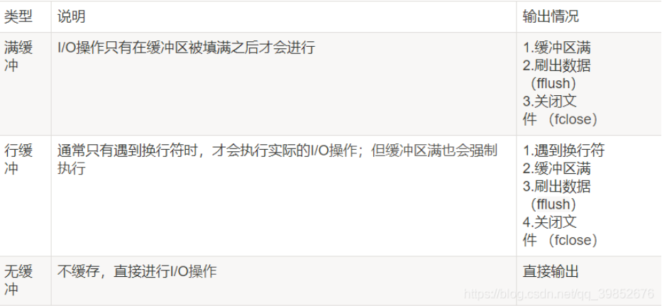
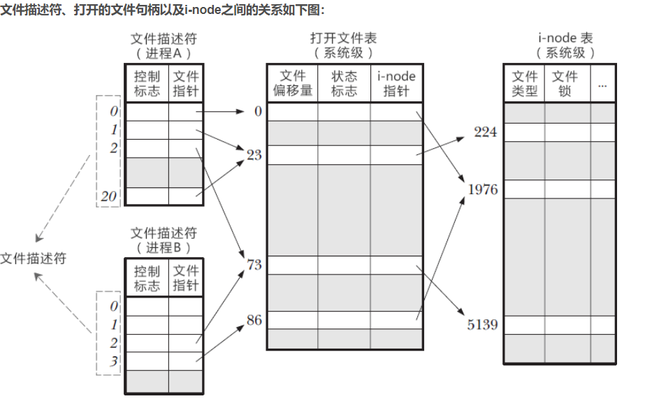

# 一、Error-handling

1. `fprintf()`函数

   ```c
      #include <stdio.h>
      int fprintf( FILE *stream, const char *format, ... );
   ```

   `fprintf()`函数根据指定的format发送信息(参数)到由stream(流)指定的文件。因此该函数可以使得信息输出到指定的文件

   ```c
   #include <stdio.h>
   // int fprintf( FILE *stream, const char *format, ... );
   int main(){
       char name[20] = "Mary";
       FILE *out;
       out = fopen( "output.txt", "w" );
       if( out != NULL )
       fprintf( out, "Hello %s\n", name );
   
   }
   ```

   fprintf()和printf()一样工作.
   printf是打印输出到屏幕，fprintf是打印输出到文件。
   fprintf()的返回值是输出的字符数,发生错误时返回一个负值.

   在有些地方，有这样的定义：printf(...)=fprintf(stdout,...)

2. `sprintf()`函数

   sprintf 是个变参函数，定义如下：

   ```c
   int sprintf( char *buffer, const char *format [, argument] ... );
   ```

   函数功能：把格式化的数据写入某个字符串

   返回值：字符串长度（strlen）

   ```c
   #include <stdio.h>
   #include<stdlib.h> 
   void main( void )
   {
       char s[80];
       char* who = "I";
       char* whom = "CSDN";
       sprintf(s, "%s love %s.", who, whom); //产生："I love CSDN. "  这字符串写到s中
       printf("s=%s\n",s);
       sprintf(s, "%6.3f", 3.1415626); //产生：" 3.142"
       printf("s=%s\n",s);
   
   }
   ```

   这可以类比打印浮点数的”%m.nf”，在”%m.ns”中，m 表示占用宽度（字符串长度不足时补空格，超出了则按照实际宽度打印），n 才表示从相应的字符串中最多取用的字符数。通常在打印字符串时m 没什么大用，还是点号后面的n 用的多

3. `stdout`和`stderr`

   - 区别

     stdout – 标准输出设备 stdout。
     stderr – 标准错误输出设备

     两者默认向屏幕输出。但如果用转向标准输出到磁盘文件，则可看出两者区别。stdout输出到磁盘文件，stderr在屏幕。

     ```c
     #include <stdio.h>
     #include<stdlib.h> 
     void main( void )
     {
         printf("Stdout Helo World!!\n");  
     
         fprintf(stdout,"Stdout Hello World!!\n");  
     
         perror("Stderr Hello World!!\n");  
     
         fprintf(stderr,"Stderr Hello World!!\n");  
     
     }
     ```

     ./test ，屏幕是四条输出，如果./test >test.txt，结果是屏幕上输出两条Stderr Hello World!!，Stdout Helo World!!在文件test.txt中，因为默认是将标准输出重定向到磁盘文件中，

     - ./test 1>testout.txt 2>testerr.txt，我们将stdout输出到文件testout.txt中,将stderr输出到testerr.txt文件中；
     - ./test 1>testout.txt ,将stdout输出到文件testout.txt 中，stderr输出到屏幕上；
     - ./test 2>testerr.txt,将stderr输出到文件testerr.txt中，stdout输出到屏幕上；
     - ./test > test.txt 2>&1,这是将stdout和stderr重定向到同一文件test.txt文件中。

   - 缓冲区

     ```c
     int main(){
     fprintf(stdout,"Hello ");
     fprintf(stderr,"World!");
     return0;
     }
     //World!Hello
     ```

     world会先输出是因为stderr是无缓冲的，会直接输出，stdout是行缓冲

     

4. `getchar()`和`putchar()`

   ```c
   ch = getchar(); //等同于 scanf("%c",&ch);
   putchar(ch);//等同于 printf("%c",ch);
   ```

5. `gets()`和`puts()`

   - scanf（）和 gets（）之间的区别

     两者都能接受字符串，但是scanf不能接受空格、制表符tab、回车等，gets()能够接受空格、制表符Tab和回车等，gets（）可接受回车键之前输入的所有**字符并用’\0’替代 ‘\n’**，**回车键不会留在输入缓冲区中**

     

   ```c
   #include<stdio.h>
   int main() {
   	// char a[10];
       char a[10]="as\0sa";
   	// gets(a);
   	// printf("%s",a);
       puts(a);
   }
   ```

   - `puts()`和`printf`，puts在 输出的时候会将字符串末尾的'\0'自动换成\n'。

6. `fgets()`和`fputs()`

   ```c
   #include <stdio.h>
   char *fgets(char *s, int size, FILE *stream);
   int fputs(const char *s, FILE *stream);
   ```

   - fgets()函数的第2个参数指明了读入字符的最大数量。如果该参数的值是n，那么fgets()将读入n-1个字符，如果fgets()函数读到一个换行符，会把它储存在字符串中。这点与gets不同，gets会丢弃换行符。fgets()函数的第三个参数指明要读入的文件。如果读入从键盘输入的数据，则以stdin作为参数。
   - fputs()函数的第二个参数指明他要写入的文件。如果要在计算机显示器上打印，则使用stdout作为参数。**与puts()函数不同，fputs()函数不会在待输出字符串末尾添加一个换行符**

   *空字符与空格不一样！！！！空字符是’ \0 ',ASCII码为0；空格的ASCII为32*

7. `fgetc()`和`fputc()`

   函数原型

   ```c
   int fgetc (FILE *fp);//返回类型是int型，为什么是int型，因为EOF的值是-1（不一定是-1，但是肯定是负数）
   int fputc ( int ch, FILE *fp );
   ```

   `fputc()`用法

   ```c
   FILE* pf = fopen("text.txt", "w");
   if(NULL == pf){
       perror(" ");
       return -1;
   }
   for(char i = 'a'; i <= 'z'; i++){
       fputc(i, pf);
   }
   fclose(pf);
   pf = NULL;
   ```

   `fgetc()`用法

   ```c
   FILE *fp;
   int ch;
   ch = fgetc(fp);
   while( ch != EOF ){
   	putchar(ch);
   	ch = fgetc(fp);
   }
   fclose(fp);
   ```

8. `memcpy()`函数

   函数原型

   ```c
   #include<string.h>
   void *memcpy(void *destin, void *source, unsigned n);
   // 返回值：指向一个destin的指针
   //作用是：以source指向的地址为起点，将连续的n个字节数据，复制到以destin指向的地址为起点的内存中。
   //函数有三个参数，第一个是目标地址，第二个是源地址，第三个是数据长度
   
   ```

   

9. 待定

# 二、文件I/O

**Linux中的文件描述符**

linux中一切都可以看成文件，在操作文件的时候，没操作一次就找一次名字，这会耗费大量的时间和效率。文件描述符就是内核为了搞笑管理这些已经被打开的文件所创建的索引，用于指代被打开的文件，所有的i/o操作都可以通过文件描述符来实现。内核通过维护3个数据结构来实现对文件的操作



- 在进程 A 中，文件描述符 1 和 20 都指向了同一个打开文件表项，标号为 23（指向了打开文件表中下标为 23 的数组元素），这可能是通过调用 dup()、dup2()、fcntl() 或者对同一个文件多次调用了 open() 函数形成的。

- 进程 A 的文件描述符 2 和进程 B 的文件描述符 2 都指向了同一个文件，这可能是在调用 fork() 后出现的（即进程 A、B 是父子进程关系），或者是不同的进程独自去调用 open() 函数打开了同一个文件，此时进程内部的描述符正好分配到与其他进程打开该文件的描述符一样。

- 进程 A 的描述符 0 和进程 B 的描述符 3 分别指向不同的打开文件表项，但这些表项均指向 i-node 表的同一个条目（标号为 1976）；换言之，它们指向了同一个文件。发生这种情况是因为每个进程各自对同一个文件发起了 open() 调用。同一个进程两次打开同一个文件，也会发生类似情况。

  ***同一个进程的不同文件描述符可以指向同一个文件；不同进程可以拥有相同的文件描述符；不同进程的同一个文件描述符可以指向不同的文件（一般也是这样，除了 0、1、2 这三个特殊的文件）；不同进程的不同文件描述符也可以指向同一个文件***

1. `dup()`和`dup2()`

   函数原型，这两个函数返回的描述符于fd描述符所指向的文件共享同一文件表项

   ```c
    #include <unistd.h>
    int  dup(int fd);
    int dup2(int fd, int fd2);
   ```

   - 调用dup函数时，dup函数会返回一个新的描述符，这个描述符一定是当前可用文件描述符中的最小值

     ```c
     #include <stdio.h>
     #include <unistd.h>
     #include <stdlib.h>
     #include <sys/stat.h>
     #include <fcntl.h>
     int main(int argc, char* argv[])
     {
         int i_fd = open("hello.txt", O_CREAT|O_APPEND|O_RDWR, 0667);
         if(i_fd < 0)
         {
             printf("open error!\n");
             return 0;
         }
         if(write(i_fd, "hello fd\n", 9) != 9)
         {
             printf("write fd error\n");
         }
         int i_dup_fd = dup(i_fd);
         if(i_dup_fd < 0)
         {
             printf("dup error!\n");
             return 0;
         }
     
         printf("i_dup_fd = %d \t i_fd = %d\n", i_dup_fd, i_fd);
         close(i_fd);
         // if(write(i_dup_fd, "zhanglinjie\n", 12) != 12)
         //     {
         //         printf("write dup fd error!\n");
         //         return 0;
         //     }
         char c_buffer[100];
         int n = 0;
         while((n = read(STDIN_FILENO, c_buffer, 1000)) != 0)
         {
             if(write(i_dup_fd, c_buffer, n) != n)
             {
                 printf("write dup fd error!\n");
                 return 0;
             }
         }
         return 0;
     }
     ```

     

   - 调用dup2函数时，可以用fd2指定新描述符的值，如果fd2本身已经打开了，则先会将其关闭。如果fd等于fd2，则返回fd2，并不关闭它

     ```c
     #include <stdio.h>
     #include <stdlib.h>
     #include <string.h>
     #include <unistd.h>
     #include <sys/stat.h>
     #include <fcntl.h>
     
     int main(int argc, char* argv[])
     {
         int i_fd = open("hello_dup2.txt", O_CREAT|O_APPEND|O_RDWR, 0666);
     
     
         if(i_fd < 0)
         {
         printf("open error!\n");
             return 0;
         }
     
         if(write(i_fd, "hello i_fd\n", 11) != 11)
         {
             printf("write dup2 error\n");
         }
     
     
         int i_dup2_fd = dup2(i_fd, STDOUT_FILENO);
     
         if(i_dup2_fd != STDOUT_FILENO)
         {
             printf("error dup2!\n");
             return 0;
         }
         close(i_fd);
     
         char c_buf[1024];
         int i_read_n = 0;
         while((i_read_n = read(STDIN_FILENO, c_buf, 1024)) != 0)
         {
         i_read_n = read(STDIN_FILENO, c_buf + i_read_n, sizeof(c_buf) - 1 - i_read_n);
             if(i_read_n < 0)
             {
                 printf("read error!\n");
                 return 0;
             }
     
             printf("%s", c_buf);
             fflush(stdout);
             sleep(1);
         }
         close(i_dup2_fd);
     
         return 0;
     
     }
     ```

     

2. `fork()`和`vfork()`

   函数原型

   ```
   #include <unistd.h>
   pid_t fork ( void );
   pid_t vfork ( void );
   ```

   fork函数的功能时创建子进程：奇妙之处在于：它被调用一次，却返回两次。它可能有`3`种不同的返回值，

   - 在父进程中，`fork`返回新创建的子进程的`PID`。
   - 在子进程中，`fork`返回`0`。
   - 如果出现错误，`fork`返回一个负值。

   ```c
   #include "unistd.h"
   #include "stdio.h"
   #include "stdlib.h"
   
   int main() {
       pid_t pid;
       int count = 0;
       pid = fork();
       count++;
       printf ( "count is %d\n", count );
       exit ( 0 );
   }
   //count = 1
   //count = 1
   
   ```

   对`fork`函数，子进程的数据空间、堆栈空间都会从父进程得到一个拷贝，而不是共享。在子进程中，对`count`进行加`1`的操作，并没有影响到父进程中的`count`，父进程中的`count`仍然为`0`，在`pid = fork();`之前，只有一个进程在执行，但在这条语句执行之后，就变成两个进程在执行了。这两个进程共享代码段，将要执行的下一条语句都是`if ( pid > 0 ) {}`。原来就存在的进程被称作`父进程`，新出现的进程被称作`子进程`，父子进程的区别在于`PID`不同。

   vfork函数的功能是创建子进程

   ```c
   #include <stdio.h>
   #include <stdlib.h>
   #include <unistd.h>
   
   int main ( void ) {
       pid_t pid;
       int var = 88;
   
       if ( ( pid = vfork() ) < 0 ) {
           printf ( "vfork error" );
           exit ( -1 );
       } else if ( pid == 0 ) { /* 子进程 */
           var++;
           exit ( 0 );
       }
   
       printf ( "pid = %d, var = %d\n", getpid(), var );
       return 0;
   }
   //pid = 283, var = 89
   
   ```

   从子进程中退出必须使用`exit`函数，不能使用`return`函数

   ```c
   #include "unistd.h"
   #include "stdio.h"
   #include "stdlib.h"
   
   int main() {
       pid_t pid;
       int count = 0;
       pid = vfork();
       count++;
       printf ( "count is %d\n", count );
       exit ( 0 );
   }
   //count is 1
   //count is 2
   
   ```

   区别：

   - `fork`：子进程拷贝父进程的数据段，父、子进程的执行次序不确定。
   - `vfork`：子进程与父进程共享数据段，子进程先运行，父进程后运行。

3. `wait()`和`waitpid()`

   函数原型

   ```c
   #include<sys/types.h>
   #include<sys/wait.h>
   pid_t wait (int * status);
   pid_t waitpid(pid_t pid,int* status,int options);
   //两函数返回：若成功则为进程ID,若出错则为-1
   ```

   - `wait`中status不为NULL时子进程的结束状态值会由参数status返回，而子进程的进程识别码作为函数值返回。调用该函数时，如果所有子进程都还在运行，则阻塞；如果一个子进程已经终止，正等待父进程获取其终止状态，则获取该子进程的终止状态然后立即返回；如果没有任何子进程将立即出错返回。当status为NULL时，只能等待一个子进程，只要子进程退出，函数退出阻塞。如果参数status的值不是NULL，wait就会把子进程退出时的状态取出并存入其中，这是一个整数值(int)，指出了子进程是正常退出还是非正常结束的(一个进程也可以被其他进程用信号结束)，以及正常结束时返回值，或被哪一个信号结束的等信息。

     ```c
     //当子进程有一个死循环无法终止，则父进程对应的wait（NULL）会一直阻塞，等待进程结束，所以就一直卡着程序无法终止。
     
     #include <stdio.h>
     #include <sys/wait.h>
     #include <unistd.h>
     #include <sys/types.h>
     int main(){
         int pid;
         printf("father progress,and father progress pid is %d\n",getpid());
     
         if(0 == fork()){
             printf("father progress forked,and child progress pid is %d\n",getpid());
         }
         else{
             if(0 == fork()){
                 printf("father progress forked,and child progress pid is %d\n",getpid());
             }
             else{
                 if(0 == fork()){
                     printf("father progress forked,and child progress pid is %d\n",getpid());
                     while(1) ;//对应第三个wait（）
                 }
                 else{
                     if(-1 == (pid = wait(NULL))){
                         printf("no child progress,and wait() return -1\n");
                     }
                     else{
                         printf("wait() return child progress pid is %d\n",pid);
                     }
                     
                     if(-1 == (pid = wait(NULL))){
                         printf("no child progress,and wait() return -1\n");
                     }
                     else{
                         printf("wait() return child progress pid is %d\n",pid);
                     }
     
                     if(-1 == (pid = wait(NULL))){
                         printf("no child progress,and wait() return -1\n");
                     }
                     else{
                         printf("wait() return child progress pid is %d\n",pid);
                     }
                 }
             }
         }
         return 0;
     }
     ```

     

   - `waitpid`，调用该函数时，如果子进程已经结束，该函数会立即返回子进程的结束状态值。子进程的结束状态会由参数status返回，而子进程的PID也会一起返回，如果不在意子进程的返回状态值，可以设置值NULL。

     ```c
     //代码
     #include <unistd.h>
     #include <sys/types.h>
     #include <sys/wait.h>
     #include <stdio.h>
     #include <stdlib.h>
     int main()
     {
         pid_t childpid;
         int status;
         childpid = fork();
     if ( childpid < 0 )
     {
         perror( "fork()" );
         exit(1);
     }
     else if ( childpid == 0 )
     {
         puts( "In child process" );
         sleep( 3 );//让子进程睡眠3秒，看看父进程的行为
         printf("\tchild pid = %d\n", getpid());
         printf("\tchild ppid = %d\n", getppid());
         exit(1);
     }
     else
     {
         waitpid( childpid, &status, 0 );
         puts( "in parent" );
         printf( "\tparent pid = %d\n", getpid() );
         printf( "\tparent ppid = %d\n", getppid() );
         printf( "\tchild process exited with status %d \n", status );
     }
     exit(0);
     }
     ```

     

     - **pid<-1，等待进程组识别码为 pid 绝对值的任何子进程**
     - **pid=-1 等待任何子进程,相当于 wait()**
     - **pid=0 等待进程组识别码与目前进程相同的任何子进程**
     - **pid>0 等待任何子进程识别码为 pid 的子进程**

     options提供一些额外的选项来控制waitpid，一般设置为0。

4. 待定

# 三、网络编程

1. `getaddrinfo()`函数

   函数原型：将主机名、主机地址、服务名和端口号的字符串表示转换为套接字地址结构和主机名、主机地址、服务名和端口号的字符串表示之间的相互转化

   ```c
   #include<netdb.h>
   int getaddrinfo( const char *hostname, const char *service, const struct addrinfo *hints, struct addrinfo **result );
   //成功返回0，出错返回非0
   void freeaddrinfo(struct addrinfo *result);
   //返回：无
   const char* gai_strerror(int errcode);
   //返回：错误消息
   /*
   hostname:一个主机名或者地址串(IPV4的点分十进制串或者IPV6的16进制串)
   service:一个服务名或者10进制端口数串
   hints:可以是一个空指针，也可以是一个指向某个addinfo结构的指针，调用者在这个结构中填入期望返回的细心类型的暗示。如果指定的服务既支持tcp也支持udp，那么调用者可以把hints结构中的ai_socktype成员设置成SOCK_DGRAM使得返回的仅仅是适用于数据报套接口 的信息。
   result:返回一个指向addrinfo结构链表的指针，指向的是由其中的ai_next成员串联起来的addrinfo结构链表
   */
     struct addrinfo{
       int ai_flags; 
       int ai_family;
       int ai_socktype;
       int ai_protocol;
       socklen_t ai_addrlen;
       char *ai_canonname;
       struct sockaddr *ai_addr;
       struct addrinfo *ai_next;
   };
   
   ```

   

2. `getnameinfo()`函数

   函数原型：将一个套接字地址结构转换成相应的主机和服务名字字符串

   ```c
   #include <sys/socket.h>
   #include <netdb.h>
   int getnameinfo(const struct sockaddr *sa, socklen_t salen,
                          char *host, size_t hostlen,
                          char *serv, size_t servlen, int flags);
   /*
   sa：指向包含协议地址的套接口地址结构，会被转换成可读的字符串，
   addrlen：是结构的长度
   
   */
   ```

   ```c
   int main(int argc, char **argv) 
   {
       struct addrinfo *p, *listp, hints;
       char buf[MAXLINE];
       int rc, flags;
   
       if (argc != 2) {
   	fprintf(stderr, "usage: %s <domain name>\n", argv[0]);
   	exit(0);
       }
   
       /* Get a list of addrinfo records */
       memset(&hints, 0, sizeof(struct addrinfo));                         
       hints.ai_family = AF_INET;       /* IPv4 only */        //line:netp:hostinfo:family
       hints.ai_socktype = SOCK_STREAM; /* Connections only */ //line:netp:hostinfo:socktype
       if ((rc = getaddrinfo(argv[1], NULL, &hints, &listp)) != 0) {
           fprintf(stderr, "getaddrinfo error: %s\n", gai_strerror(rc));
           exit(1);
       }
   
       /* Walk the list and display each IP address */
       flags = NI_NUMERICHOST; /* Display address string instead of domain name */
       for (p = listp; p; p = p->ai_next) {
           Getnameinfo(p->ai_addr, p->ai_addrlen, buf, MAXLINE, NULL, 0, flags);
           printf("%s\n", buf);
       } 
   
       /* Clean up */
       Freeaddrinfo(listp);
   
       exit(0);
   }
   ```

   

3. `setsockopt()`函数

   ```c
   #include <sys/socket.h>
   int getsockopt(int sockfd, int level, int optname, void *optval, socklen_t *optlen);
    /*
   sockfd：一个标识套接口的描述字。
   level：选项定义的层次。例如，支持的层次有SOL_SOCKET、IPPROTO_TCP等。
   optname：需获取的套接口选项。
   optval：指针，指向存放所获得选项值的缓冲区。
   optlen：指针，指向optval缓冲区的长度值。
   */
   
   int setsockopt(int sockfd, int level, int optname, const void *optval, socklen_t optlen);
   /*
   sockfd：标识一个套接口的描述字。
   level：选项定义的层次；支持SOL_SOCKET、IPPROTO_TCP、IPPROTO_IP和IPPROTO_IPV6等。
   optname：需设置的选项。
   optval：指针，指向存放选项值的缓冲区。
   optlen：optval缓冲区长度。
   */
   
   ```

   - getsockopt()函数用于获取任意类型、任意状态套接口的选项当前值，并把结果存入optval
   - setsockopt()函数用于任意类型、任意状态套接口的设置选项值。尽管在不同协议层上存在选项，但本函数仅定义了最高的“套接口”层次上的选项

   | level级别：SOL_SOCKET      |                  |         |                                                              |
   | -------------------------- | ---------------- | :-----: | ------------------------------------------------------------ |
   | optname                    | 选项值数据类型   |  访问   | 说明                                                         |
   | SO_ACCEPTCONN              | bool             |   get   | 如为TRUE（真） ，表明套接字处于监听模式                      |
   | SO_BROADCAST               | bool             | get/set | 如TRUE，表明套接字已配置成对广播消息进行发送                 |
   | SO_CONNECT_TIME            | int              |   get   | 返回套接字建立连接的时间，以秒为单位，如尚未连接，返回0xffffffff |
   | SO_DEBUG                   | bool             | get/set | 如果TRUE，就允许调试输出 (W32不支持)                         |
   | SO_DONTLINGER              | bool             | get/set | 如果是TRUE，则禁用SO_LINGER                                  |
   | SO_LINGER                  | struct linger    | get/set | 设置或获取当前的拖延值                                       |
   | SO_DONTROUTE               | bool             | get/set | 如果TRUE,便直接向网络接口发送消息，毋需查询路由表            |
   | SO_ERROR                   | bool             |   get   | 返回错误状态                                                 |
   | SO_EXCLUSIVEADDRUSE        | bool             | get/set | 如果TRUE，套接字绑定那个本地端口就不能重新被另一个进程使用   |
   | SO_KEEPALIVE               | bool             | get/set | 如果TRUE，套接字就会进行配置，在会话过程中发送”保持活动”消息 |
   | SO_MAX_MSG_SIZE            | unsigned int     |   get   | 对一个面向消息的套接字来说，一条消息的最大长度               |
   | SO_OOBINLINE               | bool             | get/set | 如果是TRUE，带外数据就会在普通数据流中返回 (W32不支持)       |
   | SO_PROTOCOL_INFO           | WSAPROTOCOL_INFO |   get   | 套接字绑定的那种协议的特征                                   |
   | SO_RCVBUF                  | int              | get/set | 面向接收操作，为每个套接字分别获取或设置缓冲区长度           |
   | **SO_REUSEADDR**           | bool             | get/set | 如果是TRUE，套接字就可与一个正由其他套接字使用的地址绑定到一起，或与处在TIME_WAIT状态的地址绑定到一起，允许重用本地地址 |
   | SO_SNDBUF                  | bool             | get/set | 设置分配给套接字的数据发送缓冲区的大小                       |
   | SO_TYPE                    | int              |   get   | 返回指定套接字的类型（如SOCK_DGRAM和SOCK_STREAM等等）        |
   | SO_SNDTIMEO                | int              | get/set | 获取或设置套接字上的数据发送超时时间（以毫秒为单位）         |
   | SO_RCVTIMEO                | int              | get/set | 获取或设置与套接字上数据接收对应的超时时间值（以毫秒为单位） |
   | SO_UPDATE_ACCEPT_CONTEXT   | SOCKET           | get/set | 更新SOCKET状态                                               |
   | **level级别：IPPROTO_IP**  |                  |         |                                                              |
   | optname(选项名)            | 选项值数据类型   |  访问   | 说明                                                         |
   | IP_OPTIONS                 | char[]           | get/set | 设置或获取IP头内的IP选项                                     |
   | IP_HDRINCL                 | bool             | get/set | 如果是TRUE,IP头就会随即将发送的数据一起提交，并从读取的数据中返回 |
   | IP_TOS                     | int              | get/set | IP服务类型                                                   |
   | IP_TTL                     | int              | get/set | IP协议的“存在时间” （TTL）                                   |
   | IP_MULTICAST_IF            | unsigned long    | get/set | 获取或设置打算从它上面发出多播数据的本地接口                 |
   | IP_MULTICAST_TTL           | int              | get/set | 为套接字获取或设置多播数据包的存在时间                       |
   | IP_MULTICAST_LOOP          | bool             | get/set | 如果TRUE，发至多播地址的数据将原封不动地“反射”或“反弹”回套接字的进入缓冲区 |
   | IP_ADD_MEMBERSHIP          | struct ip_mreq   |   set   | 在指定的IP组内为套接字赋予成员资格                           |
   | IP_DROP_MEMBERSHIP         | struct ip_mreq   |   set   | 将套接字从指定的IP组内删去（撤消成员资格）                   |
   | IP_DONTFRAGMENT            | bool             | get/set | 如果是TRUE，就不对IP数据报进行分段                           |
   | **level级别：IPPROTO_TCP** |                  |         |                                                              |
   | optname(选项名)            | 选项值数据类型   |  访问   | 说明                                                         |
   | TCP_NODELAY                | bool             | get/set | 若为TRUE, 就会在套接字上禁用Nagle算法 (只适用于流式套接字)   |

4. 待定

# 四、多线程

线程(thread)是运行在一个进程上下文中的一个逻辑流，是进程中一个基本的活动对象，内核调度的**基本对象**是线程

1. `pthread_create()`函数

   ```c
   #include<pthread.h>
   int pthread_create(pthread_t* restrict tid,const pthread_attr_t* restrict attr,void* (*start_rtn)(void*),void *restrict arg);
   //成功返回0，否则返回错误码 
   //创建线程
   ```

   参数解析

   - tidp：事先创建好的pthread_t类型的参数。成功时tidp指向的内存单元被设置为新创建线程的线程ID。

   - attr：用于定制各种不同的线程属性，一般设置为NULL。
   - \*(\*start_routine)(void *):传递新线程所要执行的函数的地址
   - arg:新线程所有执行的函数的参数

   函数功能是创建线程

2. `pthread_exit()`函数

   ```c
   #include<pthread.h>
   int pthread_exit(void *value_ptr);
   /*
   	功能：退出当前子线程。与在某个函数中返回区别一下。
   	参1：retval表示线程退出状态，通常传NULL。
   */
   ```

   参数解析

   - value_ptr指向线程返回的某个对象

   线程通过调用pthread_exit函数终止执行，并带回指向某个对象的指针。

   **注意：绝不能用它返回一个指向局部变量的指针，因为线程调用该函数后，这个局部变量就不存在了，这将引起严重的程序漏洞**

3. `pthread_join()`函数

   ```c
   #include<pthread.h>
   int pthread_join(pthread_t thread, void **retval);
   args:
       pthread_t thread: 被连接线程的线程号
       void **retval : 指向一个指向被连接线程的返回码的指针的指针
   return:
       线程连接的状态，0是成功，非0是失败
   ```

   一般此函数用在主线程中，等待通过thread指定的线程终止，此函数调用成功，可以通过value_ptr获取终止线程的返回值

4. `pthread_cancel()`函数

   ```c
   #include<pthread.h>
   int pthread_cancel(pthread_t thread);
   args:
   	thread:要取消的线程
   return:
   	成功返回0，失败返回-1
   ```

5. `sem_init()`函数

   ```c
   #include <semaphore.h>
   int sem_init(sem_t *sem, int pshared, unsigned int value);
   /*
   args:
   	sem:被初始化的匿名信号量
       value:指定信号量的初始值
       pshared:值为0指明信号量是进程内线程共享，非零值表示进程之间共享
   功能：信号量初始化
   */
   //属于信号量
   ```

6. `sem_wait()`函数、`sem_post()`函数和`sem_destory()`函数

   ```c
   int sem_wait(sem_t *sem); 
   /*
   args:
   	sem:
   功能：以原子操作的方式给信号量的值减一，非零时减一，零时这个函数阻塞，直到有线程增加了该信号量的值使其不再为0。P操作
   */
   int sem_trywait(sem_t* sem);//sem_wait的非阻塞版本，不论被操作的信号量是否具有非0值
   int sem_post(sem_t *sem);
   /*
   功能：
   	以原子操作的方式给信号量的值加1 V操作
   	*/
   int sem_destroy(sem_t *sem);
   /*
   功能：用完信号量后对它进行清理，清理该信号量所拥有的资源
   */
   //属于信号量
   ```

7. 线程互斥锁

   - 引入互斥(mutual exclusion)锁的目的是用来保证共享数据操作的完整性
   - 互斥锁主要用来保护临界资源
   - 每个临界资源都由一个互斥锁来保护，任何时刻最多只能有一个线程能访问该资源
   - 线程必须先获得互斥锁才能访问临界资源，访问完临界资源后释放该锁。如果无法获得锁，线程会阻塞直到获得锁为止

   ```c
   #include<pthread.h>
   int pthread_mutex_init(pthread_mutex_t *mutex, const pthread_mutexattr_t *mutexattr);//初始化互斥锁，mutexattr知道互斥锁的属性，默认属性为NULL
   int pthread_mutex_destroy(pthread_mutex_t *mutex);
   int pthread_mutex_lock(pthread_mutex_t *mutex);
   int pthread_mutex_trylock(pthread_mutex_t *mutex);
   int pthread_mutex_unlock(pthread_mutex_t *mutex);
   ```

   - mutex指向要操作的目标互斥锁，类型是pthread_mutex_t结构体，`pthread_mutex_t mutex=PTHREAD_MUTEX_INITIALIZER`把互斥锁的各个字段都初始化为0
   - pthread_mutex_lock函数以原子方式给互斥锁加锁，如果目标锁被锁上，则调用将阻塞，直至该互斥锁的占有者将其解锁
   - pthread_mutex_unlocak函数以原子方式给互斥锁解锁，如果有其他线程正在等待，这些线程的某一个将获得它

8. 互斥锁属性

   ```c
   #include＜pthread.h＞
   /*初始化互斥锁属性对象*/
   int pthread_mutexattr_init(pthread_mutexattr_t*attr);
   /*销毁互斥锁属性对象*/
   int pthread_mutexattr_destroy(pthread_mutexattr_t*attr);
   /*获取和设置互斥锁的pshared属性*/
   int pthread_mutexattr_getpshared(const
   pthread_mutexattr_t*attr,int*pshared);
   int pthread_mutexattr_setpshared(pthread_mutexattr_t*attr,int
   pshared);
   /*获取和设置互斥锁的type属性*/
   int pthread_mutexattr_gettype(const
   pthread_mutexattr_t*attr,int*type);
   int pthread_mutexattr_settype(pthread_mutexattr_t*attr,int
   type);
   ```

   1. pthread属性：是否允许跨进程共享互斥锁
      - PTHREAD_PROCESS_SHARED。互斥锁可以被跨进程共享
      - PTHREAD_PROCESS_PRIVATE。互斥锁只能被和锁的初始化 线程隶属于同一个进程的线程共享
   2. type属性：互斥锁类型
      - PTHREAD_MUTEX_NORMAL，普通锁。默认类型，当一个线程对一个普通锁加锁后，其余请求该锁的线程将形成一个队列，并在该锁解锁后按照优先级获得它。保证资源分配的公平性。引发问题：对一个已经被其他线程加锁的普通锁再次加锁，将引发死锁问题；对一个已经被其他线程加锁的普通锁解锁，或者对一个已经解锁的普通锁再次解锁，将导致不可预期的后果
      - PTHREAD_MUTEX_ERRORCHECK，检测锁。一个线程如果对一个已经加锁的检测锁再次加锁，则加锁操作返回EDEADLK。对一个已经被其他加锁的检测锁解锁，或者对一个已经解锁的检测锁再次解锁，则解锁操作返回EPERM.
      - PTHREAD_MUTEX_RECURSIVE，嵌套锁。这种锁允许一个线程在释放锁之前多次对它加锁而不发生死锁。不过其他线程如果要获得这个锁，则当前锁的拥有者必须执行相应次数的解锁操作。对于一个已经被其他线程加锁的嵌套锁解锁，或者对一个已经解锁的嵌套锁再次解锁，则解锁会返回EPERM
      - PTHREAD_MUTEX_DEFAULT，默认锁。一个线程如果对一个 已经加锁的默认锁再次加锁，或者对一个已经被其他线程加锁的默认 锁解锁，或者对一个已经解锁的默认锁再次解锁，将导致不可预期的 后果

9. 线程条件变量

   **如果说互斥锁是用于同步线程对共享数据的访问的话，那么条件 变量则是用于在线程之间同步共享数据的值**

   ```c
   #include＜pthread.h＞
   int pthread_cond_init(pthread_cond_t*cond,const
   pthread_condattr_t*cond_attr);
   int pthread_cond_destroy(pthread_cond_t*cond);
   int pthread_cond_broadcast(pthread_cond_t*cond);
   int pthread_cond_signal(pthread_cond_t*cond);
   int pthread_cond_wait(pthread_cond_t*cond,pthread_mutex_t*mutex);
   
   ```

   - cond指向要操作的目标条件变量，条件变量的类型是pthread_cond_t结构体。
   - pthread_cond_init函数用于初始化条件变量。cond_attr参数指定条 件变量的属性。如果将它设置为NULL，则表示使用默认属性。条件 变量的属性不多，而且和互斥锁的属性类型相似，`pthread_cond_t cond=PTHREAD_COND_INITIALIZER`把条件变量的各个字段都初始化为0
   - pthread_cond_destroy函数用于销毁条件变量，以释放其占用的内 核资源
   - pthread_cond_broadcast函数以广播的方式唤醒所有等待目标条件变量的线程。
   - pthread_cond_signal函数用于唤醒一个等待目标条件变量的线程。至于哪个线程被唤醒，取决于线程的优先级和调度策略(没有调用特定线程的函数，可以使用pthread_cond_broadcast间接实现)
   - pthread_cond_wait函数用于等待目标条件变量。mutex参数是用于保护条件变量的互斥锁，mutex参数是用于保护条件变量的互斥锁，以确保pthread_cond_wait操作的原子性。在调用pthread_cond_wait前，必须保证互斥锁已经加锁，否则将报错。函数执行时，首先把调用线程放入条件变量的等待队列中，然后将互斥锁mutex解锁。

   消费者伪代码

   ```c
   pthread_mutex_lock(&mutex); // 拿到互斥锁，进入临界区
   while( 条件为假)
   	pthread_cond_wait(cond, mutex); // 令进程等待在条件变量上
   修改条件
   pthread_mutex_unlock(&mutex); // 释放互斥锁
   ```

   生产者伪代码

   ```c
   pthread_mutex_lock(&mutex); // 拿到互斥锁，进入临界区
   设置条件为真
   pthread_cond_signal(cond); // 通知等待在条件变量上的消费者
   pthread_mutex_unlock(&mutex); // 释放互斥锁
   ```

10. 待定

# 五、多进程

1. 