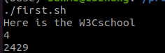
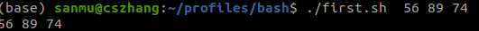
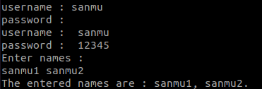

# bash

1. 注释

   ```bash
   #!/bin/bash    告诉系统使用这个脚本解释命令
   #			单行注释
    
   :<<BLOCK
   ....注释内容
   BLOCK
   
   ```

2. 引号

   打印字符串时，双引号和单引号没有区别，打印已定义的变量时必须使用双引号

   ```bash
   comment="Welcome to W3Cschool!"
   echo "$comment"
   ```

3. 变量

   - =两遍不允许有空格

   - 区分大小写

   - 自动匹配变量类型

   - 命令行参数

     - `$0` ——指定要调用的脚本名称。
     - `$1-9` ——存储前9个自变量的名称，或可用作自变量的位置。
     - `$#` ——指定传递给脚本的参数总数。
     - `$*` ——将所有命令行参数连接在一起来存储它们。
     - `$@` ——将参数列表存储为数组。
     - `$?` ——指定最后一个命令或最近执行过程的推出状态。
     - `$$` ——指定当前脚本的进程 ID 。
     - `$!` ——显示最后一个后台作业的 ID 。

     ```bash
     #!/bin/bash
     echo $0 
     echo $1 $2 $3 $4 $5 $6 $7 $8 $9
     echo $#
     echo $$     
     ```

     

   - 数组传参

     ```bash
     #!/bin/bash
     parameter=("$@")
     echo ${parameter[0]} ${parameter[1]} ${parameter[2]}
     ```

     

4. bash读取用户输入

   `read <variable_name>`

   - read -a指脚本读取数组，传入多个数据

   - read -s输入保持在静默模式，-sp隐藏密码

   - read -p 在同一行输入

     ```bash
     #!/bin/bash
     read -p "username : " user_var
     read -sp "password : " pass_var
     echo
     echo "username : " $user_var
     echo "password : "  $pass_var
     echo "Enter names : "
     read -a names
     echo "The entered names are : ${names[0]}, ${names[1]}."
     ```

     

5. 算术运算

   - `((expression)) `双括号使用

   - `expr`不会将结果保存到变量中，直接输出操作数和操作符中间要有空格

   - `let <arithmetic expression>`，算术运算完成后将结果存储至变量中

     ```bash
     #!/bin/bash
     Num1=5
     Num2=3
     ((Num3=Num1+Num2))
     echo "Num3 = $Num3"
     
     expr $Num1 + $Num2
     
     let "Num5 = $(( Num1 + Num2 ))"
     echo "Num5= $Num3"
     ```

     

6. if语句

   ```bash
   if [ condition ];
   then
   <commands>
   elif [ condition ];
   then
   <commands>
   else
   <commands>
   fi
   ```

7. case语句

   ```bash
   #!/bin/bash
   echo "Which Operating System are you using?"
   echo "Windows, Android, Chrome, Linux, Others?"
   read -p "Type your OS Name:" OS
   case $OS in
       Windows|windows|window|win)
           echo "That's common. You should try something new."
           echo
           ;;
       Android|android)
           echo "This is my favorite. It has lots of applications."
           echo
           ;;
       Chrome|chrome)
           echo "Cool!!! It's for pro users. Amazing Choice."
           echo
           ;;
       Linux|linux)
           echo "You might be serious about security!!"
           echo
           ;;
       *)
           echo "Sounds interesting. I will try that."
           echo
           ;;
   esac
   ```

8. for循环

   ```bash
   for variable in list
   do
   commands
   done
   //或
   for (( expression1; expression2; expression3 ))
   do
   commands
   done
   ```

9. 字符串截取

   ```bash
   value="123abc456abc789"
   echo ${value#*abc}           #456abc789  从左往右，删除最短的一个以string结尾的子串，即截取第一个string子串之后的字符串
   echo ${value##*abc}          #789		从左往右，删除最长的一个以string结尾的子串，即截取最后一个string子串之后的字符串
   echo ${value%abc*}           #123abc456		从右往左，删除最短的一个以string开头的子串，即截取最后一个string子串之前的字符串
   echo ${value%%abc*}          #123			从右往左，删除最长的一个以string开头的子串，即截取第一个string子串之前的字符串
   echo ${value:0:3}            #123			截取变量varible从位置start开始长度为len的子串。第一个字符的位置为0
   ```

   

10. 扫描文件夹文件

   ```bash
   for file in `ls ${SCERARIOS_DIR}` 				#file为SCERARIOS_DIR目录下的各个文件
   do
       for doc in `ls ${SCERARIOS_DIR}/${file}`   #doc为子目录中的各个file
   ```

   

11. 待定

# 实践

## set

```c
#!/usr/bin/env bash
set -u			//如果不设置-u会造成未定义的变量输出空行，跳过输出，不会报错，设置-u后为使用未定义的变量会保存
echo $a			//与set -o nounset相同
echo "bar"
```

```c
#!/usr/bin/env bash
set -x   //等价于 set -o xtrace
echo bar
```

表示执行脚本时会先将命令打印出来，首行以`+`表示

```c
#!/usr/bin/env bash
set -e
```

不加set -e时如果某行出错bash依旧会执行，该功能使脚本只要发生错误，就终止执行

```ba
while IFS= read -r line; do
	echo "$line"
done < ../scripts/all_routes.txt
```

