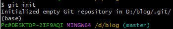
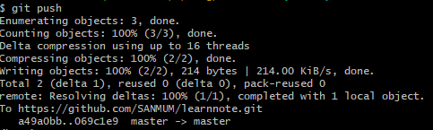
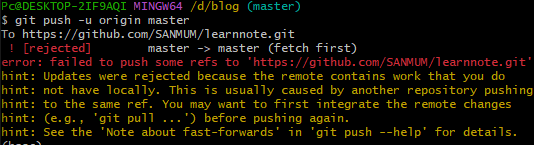

# 上传代码到git仓储

1. **打开Git Bash Here**

   `cd path`

2. **初始化git init**

   将当前目录设置为git文件夹

   `git init`

   

3. 收集目录下文件暂存

   ​	add 后.不能省略，上传速度会受到文件大小和数量的影响

   ​		`git add .`

   ​		`git commit -m "update"

4. **配置用户环境**

   第一次上传需要验证，第二次上传跳过

   ```
    1. 输入你的邮箱：git config --global user.email "邮箱名"
    2. 输入git用户名：git config --global user.name "用户名"
    3. 输入创建仓库时的地址：git remote add  origin "仓库url"
    4. 出现已存在的错误：
    	1、输入git remote rm origin 删除关联的origin的远程库
   	2、关联自己的仓库 git remote add origin https://gitee.com/xxxxxx.git
   
   ```

   配置并上传到github

   - 第一步，创建ssh key，找到.ssh目录，看有没有id_rsa和id_rsa.pub这两个文件，如果有的话，直接跳过，脚本执行 ssh-keygen -t rsa -C '邮箱地址'，生成上述公私钥

   - 第二步：登录github,打开” settings”中的SSH Keys页面，然后点击“Add SSH Key”,填上任意title，在Key文本框里黏贴id_rsa.pub文件的内容，title中输入名称key输入刚刚生成的已pub后缀的公钥，使用文本打开该文件全部Copy到 key中，点击Add Key

5. **上传代码到git仓库中**

   - 注意：第一次上传需要加-u

   - `git push -u origin master`

   - ```
     echo "# SANMUM" >> README.md
     git init
     git add README.md
     git commit -m "first commit"
     git branch -M main
     git remote add origin https://github.com/SANMUM/SANMUM.git
     git push -u origin main
     已存在的时候：
     git remote add origin https://github.com/SANMUM/SANMUM.git
     git branch -M main
     git push -u origin main`
     ```


# 删除特定文件

1. 将github远程仓库中克隆中克隆我们需要操作的远程仓库

   `git clone <仓库地址>`

2. 进入到本地仓库

    `cd gitrepo`

3. 删除特定文件/文件夹

    `git rm -r dir`

4. 添加commit

    `git commit -m "delete"`

5. 将本地的内容推送到远程仓库

    `git push`


6. 上传速度慢的解决方案（挂vpn)

  ```
  git config --global http.proxy http://127.0.0.1:7890
  git config --global https.proxy http://127.0.0.1:7890
  ```

  

 7. 上传出错时

  

  `git pull`

  重新上传
