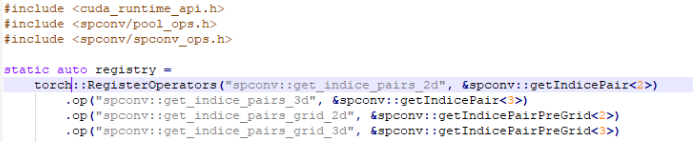
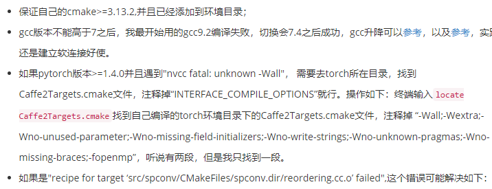

# spconv1.21 + pcdnet 安装步骤

conda11.6

torch 安装

```c
git https://github.com/HanjiangHu/Multi-LiDAR-Placement-for-3D-Detection.git
cd OpenPCDet
pip install -r requirements.txt 
pip install torch==1.9.1+cu111 torchvision==0.10.1+cu111 torchaudio==0.9.1 -f https://download.pytorch.org/whl/torch_stable.htm

```

spconv 1.2.1安装

```c
cd spconv
python setup.py bdist_wheel
cd dist
pip install *.whl
```

中间报错

```c
subprocess.CalledProcessError: Command '['cmake', '/home/xxx/spconv', '-DCMAKE_PREFIX_PATH=/home/hzc/.local/lib/python3.8/site-packages/torch', '-DPYBIND11_PYTHON_VERSION=3.8', '-DSPCONV_BuildTests=OFF', '-DPYTORCH_VERSION=10801', '-DCMAKE_CUDA_FLAGS="--expt-relaxed-constexpr" -D__CUDA_NO_HALF_OPERATORS__ -D__CUDA_NO_HALF_CONVERSIONS__', '-DCMAKE_LIBRARY_OUTPUT_DIRECTORY=/home/xxx/spconv/build/lib.linux-x86_64-3.8/spconv', '-DCMAKE_BUILD_TYPE=Release']' returned non-zero exit status 1.

```

报错原因

```
anaconda3/envs/pytorch/lib/python3.7/site-packages/torch/share/cmake/Caffe2/public/cuda.cmake
```

进入改文件注释

```c
# ---[ Extract versions
if(CAFFE2_USE_CUDNN)
  # Get cuDNN version
  if(EXISTS ${CUDNN_INCLUDE_PATH}/cudnn_version.h)
    file(READ ${CUDNN_INCLUDE_PATH}/cudnn_version.h CUDNN_HEADER_CONTENTS)
  else()
    file(READ ${CUDNN_INCLUDE_PATH}/cudnn.h CUDNN_HEADER_CONTENTS)
  endif()
  string(REGEX MATCH "define CUDNN_MAJOR * +([0-9]+)"
               CUDNN_VERSION_MAJOR "${CUDNN_HEADER_CONTENTS}")
  string(REGEX REPLACE "define CUDNN_MAJOR * +([0-9]+)" "\\1"
               CUDNN_VERSION_MAJOR "${CUDNN_VERSION_MAJOR}")
  string(REGEX MATCH "define CUDNN_MINOR * +([0-9]+)"
               CUDNN_VERSION_MINOR "${CUDNN_HEADER_CONTENTS}")
  string(REGEX REPLACE "define CUDNN_MINOR * +([0-9]+)" "\\1"
               CUDNN_VERSION_MINOR "${CUDNN_VERSION_MINOR}")
  string(REGEX MATCH "define CUDNN_PATCHLEVEL * +([0-9]+)"
               CUDNN_VERSION_PATCH "${CUDNN_HEADER_CONTENTS}")
  string(REGEX REPLACE "define CUDNN_PATCHLEVEL * +([0-9]+)" "\\1"
               CUDNN_VERSION_PATCH "${CUDNN_VERSION_PATCH}")
  # Assemble cuDNN version
  if(NOT CUDNN_VERSION_MAJOR)
    set(CUDNN_VERSION "?")
  else()
    set(CUDNN_VERSION
        "${CUDNN_VERSION_MAJOR}.${CUDNN_VERSION_MINOR}.${CUDNN_VERSION_PATCH}")
  endif()
  message(STATUS "Found cuDNN: v${CUDNN_VERSION}  (include: ${CUDNN_INCLUDE_PATH}, library: ${CUDNN_LIBRARY_PATH})")
  if(CUDNN_VERSION VERSION_LESS "7.0.0")
    message(FATAL_ERROR "PyTorch requires cuDNN 7 and above.")
  endif()
endif()
```

torch版本报错，1.4以上将jit移除，将torch::jit::RegisterOperators::RegisterOperators替换为torch::RegisterOperators::RegisterOperators再次编译即可

```c
error: 、(const char [28], <unresolved overloaded function type>)’

```





- `spconv.xxx` move to `spconv.pytorch.xxx`, change all `import spconv` to `import spconv.pytorch as spconv` and `from spconv.xxx import` to `from spconv.pytorch.xxx import`.
- `use_hash` and `fused_bn` in Sparse Convolution is removed, we only use hash table in 2.x.
- `x.features = F.relu(x.features)` now raise error. use `x = x.replace_feature(F.relu(x.features))` instead.
- weight layout has been changed to RSKC (native algorithm) or KRSC (implicit gemm), no longer RSCK (spconv 1.x). RS is kernel size, C is input channel, K is output channel.
- all util ops are removed (pillar scatter/nms/rbbox_iou...)
- VoxelGenerator has been replaced by `spconv.pytorch.utils.PointToVoxel` (torch API) or Point2VoxelGPU[1-4]d/Point2VoxelCPU[1-4]d (tv.Tensor API).
- spconv < 2.1 don't support CPU. spconv 2.1+ support cpu for debug usage.
- test spconv 1.x model in spconv 2.x: Linux: `export SPCONV_SAVED_WEIGHT_LAYOUT="RSCK"`, Windows powershell: `$Env:SPCONV_SAVED_WEIGHT_LAYOUT = "RSCK"`.

## conda环境配置

1. pip换源

   ```python
   #linux的文件在~/.pip/pip.conf，
   
   #windows在%HOMEPATH%\pip\pip.ini），
   #将其修改为
   [global]
   index-url = http://pypi.douban.com/simple
   [install]
   trusted-host=pypi.douban.com
   
   ```

2. linux下安装mayavi库

   ```python
   #python版本3.6 or 3.7 , 安装依赖numpy
   pip install vtk==9.0.1
   pip install mayavi==4.7.3
   pip install PyQt5
   ```

3. 待定

# cuda安装

卸载已有驱动

```shell
sudo /usr/bin/nvidia-uninstall
sudo apt-get --purge remove nvidia-*

```

安装cuda-driver 11.6

```shell
# deb安装
wget https://developer.download.nvidia.com/compute/cuda/repos/ubuntu2004/x86_64/cuda-ubuntu2004.pin
sudo mv cuda-ubuntu2004.pin /etc/apt/preferences.d/cuda-repository-pin-600
wget https://developer.download.nvidia.com/compute/cuda/11.8.0/local_installers/cuda-repo-ubuntu2004-11-8-local_11.8.0-520.61.05-1_amd64.deb
sudo dpkg -i cuda-repo-ubuntu2004-11-8-local_11.8.0-520.61.05-1_amd64.deb
sudo cp /var/cuda-repo-ubuntu2004-11-8-local/cuda-*-keyring.gpg /usr/share/keyrings/
sudo apt-get update
sudo apt-get -y install cuda
# run.file安装
wget https://developer.download.nvidia.com/compute/cuda/11.6.2/local_installers/cuda_11.6.2_510.47.03_linux.run
sudo sh cuda_11.6.2_510.47.03_linux.run
#添加环境变量
# CUDA toolkit setup
export PATH=$PATH:/usr/local/cuda-11.6/bin
export LD_LIBRARY_PATH=$LD_LIBRARY_PATH:/usr/local/cuda-11.6/lib64
#Ubuntu 安装 NVIDIA 显卡驱动详细步骤（ERROR: The Nouveau kernel driver is currently in use by your system）
sudo vim /etc/modprobe.d/blacklist-nouveau.conf
#添加
blacklist nouveau
options nouveau modeset=0
#查询,无输出禁用成功
lspci | grep nouveau 
#查看推荐系统版本
ubuntu-drivers devices

sudo service lightdm stop
sudo ./NVIDIA-Linux-x86_64-440.82.run --no-opengl-files

```

cudnn安装

```shell
# 复制cudnn头文件
sudo cp cuda/include/* /usr/local/cuda-11.4/include/
# 复制cudnn的库
sudo cp cuda/lib/* /usr/local/cuda-11.4/lib64/
# 添加可执行权限
sudo chmod +x /usr/local/cuda-11.4/include/cudnn.h
sudo chmod +x /usr/local/cuda-11.4/lib64/libcudnn*
#添加cuda相关路径
export PATH="$PATH:/usr/local/cuda-11.8/bin"
export LD_LIBRARY_PATH="$LD_LIBRARY_PATH:/usr/local/cuda-11.8/lib64/"
export LIBRARY_PATH="$LIBRARY_PATH:/usr/local/cuda-11.8/lib64"

```

# CMAKE安装

```shell
# 移除当前版本
sudo apt autoremove cmake
# 官网下载 https://cmake.org/download/
cd path/CMake-3.18.0-rc1
# 配置
./bootstrap --prefix=/usr/local/cmake
# 编译
make -j 4
# 安装
make install

#方法二
vim ~/.profile
export PATH=$PATH:/cmake/bin
cmake --version
```

# boost安装

```shell
#安装依赖项
sudo apt-get install libboost-all-dev

# 下载完成后
tar -xzvf boost_1_65_1.tar.gz
cd boost_1_65_1

./bootstrap.sh --with-python=/home/zhanglinjie/anaconda3/envs/py37/bin/python3.7 --with-python-version=3.7 --with-python-root='/home/zhanglinjie/anaconda3/envs/py37/lib/python3.7' --prefix=/usr/local
./b2 cflags='-fPIC' cxxflags='-fPIC' --with-python include='/home/zhanglinjie/anaconda3/envs/py37/include/python3.7m'
sudo ./b2 install -a --with=all

./bootstrap.sh --with-python=/usr/bin/python3 --with-python-version=3.5 --with-python-root=/usr/local/lib/python3.5 --prefix=/usr/local
sudo ./b2 install -a --with=all
sudo ldconfig
######problem#######
/home/zhanglinjie/anaconda3/envs/py37/compiler_compat/ld: cannot find -lboost_python: No such file or directory
########solve#######
sudo ln -s /usr/local/lib/libboost_python37.so /usr/lib/libboost_python.so
################注释#########
ln -s source.files symbolic.link
########symbolic#####bug######
/sbin/ldconfig.real: /usr/local/cuda-11.6/targets/x86_64-linux/lib/libcudnn_cnn_train.so.8 is not a symbolic link
####symbolic#####solve#######
sudo ln -sf /usr/local/cuda/targets/x86_64-linux/lib/libcudnn_adv_train.so.8.0 /usr/local/cuda/targets/x86_64-linux/lib/libcudnn_adv_train.so.8
sudo ln -sf /usr/local/cuda/targets/x86_64-linux/lib/libcudnn_ops_infer.so.8.0 /usr/local/cuda/targets/x86_64-linux/lib/libcudnn_ops_infer.so.8
sudo ln -sf /usr/local/cuda/targets/x86_64-linux/lib/libcudnn_cnn_train.so.8.0 /usr/local/cuda/targets/x86_64-linux/lib/libcudnn_cnn_train.so.8
sudo ln -sf /usr/local/cuda/targets/x86_64-linux/lib/libcudnn_adv_infer.so.8.0 /usr/local/cuda/targets/x86_64-linux/lib/libcudnn_adv_infer.so.8
sudo ln -sf /usr/local/cuda/targets/x86_64-linux/lib/libcudnn_ops_train.so.8.0 /usr/local/cuda/targets/x86_64-linux/lib/libcudnn_ops_train.so.8
sudo ln -sf /usr/local/cuda/targets/x86_64-linux/lib/libcudnn_cnn_infer.so.8.0 /usr/local/cuda/targets/x86_64-linux/lib/libcudnn_cnn_infer.so.8
##########end############
```

